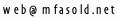

I am interested in bioinformatics, software engineering management, genomics data science and entrepreneurship.

### 💡 Research publications

My research focuses on the fields of computational biology and genomics.

- [Publications on Google Scholar](https://scholar.google.com/citations?user=HbaZiXQAAAAJ)
- [Journal Publications on Research Gate](https://www.researchgate.net/profile/Mario-Fasold/research)

### 🧬 Scientific software and web services

I developed or participated in the development of several bioinformatics tools.

- [DARIO](http://dario.bioinf.uni-leipzig.de/) - a web server for the analysis of short RNAs from high throughput sequencing data
- [AffyRNADegradation R Package](http://www.bioconductor.org/packages/release/bioc/html/AffyRNADegradation.html) - analyze and correct probe positional bias in microarray data due to RNA degradation
- [Larpack](https://web.archive.org/web/20161011085215/http://www.izbi.uni-leipzig.de/downloads_links/programs/hook.php) - Hook analysis of GeneChip microarrays
- [Github Page](https://github.com/mfasold) - Provding the source for these and other software

### :rocket: Entrepreneurship 
I co-founded the following startups.

<table class="table fs-6">
  <thead>
    <tr>
      <th scope="col">#</th>
      <th scope="col">Name</th>
      <th scope="col">Activity</th>
      <th scope="col">Time</th>
      <th scope="col">Exit</th>
    </tr>
  </thead>
  <tbody>
    <tr>
      <th scope="row">1</th>
      <td>Concept Two</td>
      <td>EDM event organisation</td>
      <td>1998-2002</td>
      <td>Discontinued, lost interest</td>
    </tr>
    <tr>
      <th scope="row">2</th>
      <td>Coomoco</td>
      <td>Mind-Mapping SaaS</td>
      <td>2004-2005</td>
      <td>Stopped, as competition was faster</td>
    </tr>
    <tr>
      <th scope="row">3</th>
      <td>Music2Mail</td>
      <td>Music release notification SaaS</td>
      <td>2005-2009</td>
      <td>Phased out, since ARPU was much lower than expected</td>
    </tr>
    <tr>
      <th scope="row">4</th>
      <td>ecSeq Bioinformatics</td>
      <td>Bioinformatics training and services</td>
      <td>2014-current</td>
      <td>Ongoing</td>
    </tr>    
    <tr>
      <th scope="row">5</th>
      <td>Seamless NGS</td>
      <td>Biomedical data analysis software</td>
      <td>2016-2017</td>
      <td>Merged with ecSeq Bioinformatics</td>
    </tr>
  </tbody>
</table>   

### 🎏 Streams and profiles

- [LinkedIn](http://www.linkedin.com/pub/mario-fasold/66/344/34)
- [Personal Blog](https://web.archive.org/web/20190701032320/http://www.mfasold.net/blog/)(2008-05 to&nbsp;2011-01, archived))
- [Twitter]() (inactive)

### 🥏 Hobbies
I like sports, in particular Ultimate Frisbee and Cycle Cross Biking, traveling, photography and more.

- [Ultimate Frisbee in Leipzig](http://www.saxydivers.de)
- [Tipps for a travel to Hawaii](http://hawaiitips.pbworks.com/)
- [SchoeneFilme](http://schoenefilme.info)
- [Last.fm](http://last.fm/user/djspad)

### 📪 Contact
If you wish to contact me, please&nbsp;use . You may try
inserting "#nospam#" to the subject.

