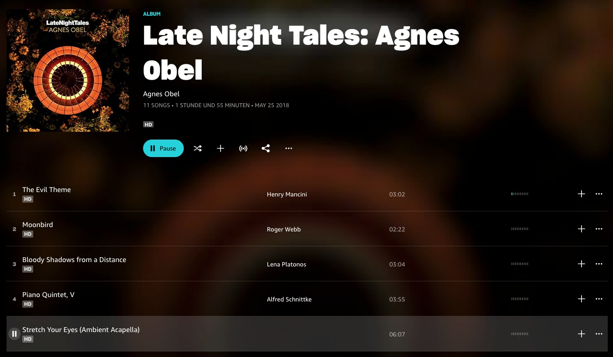
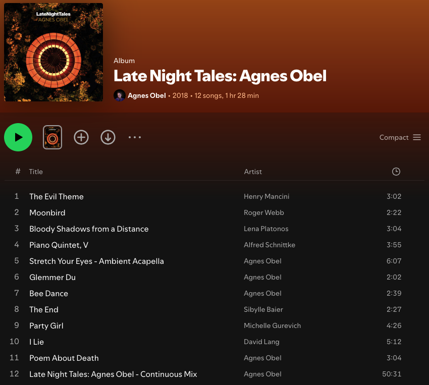
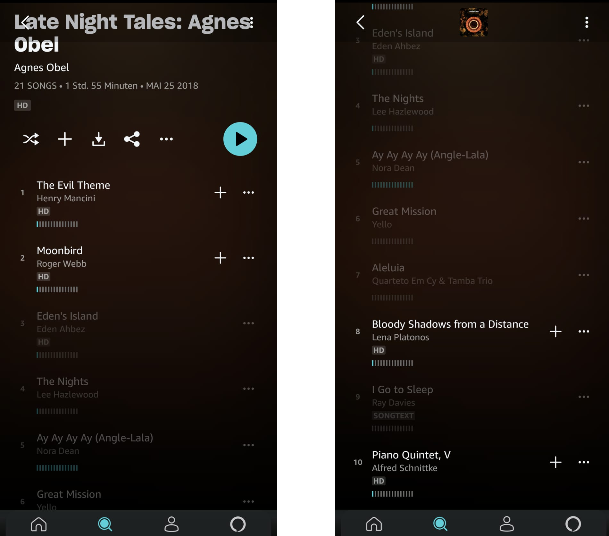

Since my youth, I have had a keen interest in music. Although I don't keep up with all the new releases in my favorite genres anymore, I would say that I exercise my interest more intensively than the majority of listeners. For example, I believe that my curated music library is essential, and I really dislike it when a song I want to listen to is not available on a music streaming service. Nowadays, also due to some pressure from my family, I have an active music streaming subscription.

From time to time, Amazon Music invites me to a free trial of their Premium subscription - I seem to fit the right demographics based on other services I use. I tried it a few years ago and found it to be lacking in polish. This year, I received another invitation and decided to give it another try. After all, Amazon Music now holds a market share of [about 40%](https://de.statista.com/infografik/28762/umfrage-zu-kundinnen-von-audiodiensten-in-deutschland/) in Germany! However, I still found several issues that hindered my experience, and I would like to document them for others who may have a similar usage pattern.

## Incomplete albums
When listening to albums I already know, I noticed that some tracks were missing from certain albums. Here is an example:

Looking at the screenshot, it appears that the album contains 11 songs. However, the [CD release](https://www.discogs.com/release/12055154-Agnes-Obel-LateNightTales) actually contains 20 songs. In this particular album, the songs are mixed together, forming a cohesive story. Listening to this album on Amazon Music leads to a list of truncated songs that stop abruptly and then jump to another section of the album. The experience is quite frustrating, maybe comparable to wanting to watch a movie but only receiving random parts of it.

Out of curiosity, I checked how Spotify does it:

Obviously there are music rights issues preventing both music streaming services from having all the songs. But: Spotify offers the album as a continuous mix, which is the appropriate approach in this case, as it allows listeners to listen to the album in full without interruptions.
## Differences between web and mobile apps
There are several surprising differences between the mobile apps and the web interface of Amazon Music. One of the most striking differences is that the mobile app actually shows the missing tracks from the above album:

## Buggy web app
In general, the Amazon Music web app seems quite brittle. I encountered the following error screen every few days:

As a result, a page reload was necessary, leading to a loss of listening progress. Additionally, the web app dislikes the Firefox browser. During my attempts, it refused to play and indicated that Firefox should be updated to the latest version, even though I was already using the most recent version.

## Strange autoplay
After completing an album, Amazon Music enters an autoplay mode where it plays related songs. While this is common for streaming services, the way this is implemented in Amazon Music is quite poor in my opinion. First, the algorithmic selection of tracks could be better. But even more annoying is that this mix often includes tracks from the previously played album. This means you hear the same songs again shortly after finishing the album. This issue is especially noticeable for albums where the songs are mixed, meaning there is no pause between them. It feels particularly strange when, after a single complete song, a part of a mix suddenly plays.

## Uncurated Playlists 
I listened to several playlists for certain genres and moods. Especially for the subgenres, I find that the selections are often quite strange and probably driven by algorithmic choices. Some songs clearly break from the subgenre and do not fit well with the majority of the playlist. While I acknowledge that playlists are subjective, Spotify's playlists, for example, have far fewer unpleasant surprises.

## Volume granularity on streaming devices
My son likes to listen to some music when he goes to bed, and I am responsible for putting on something to his liking. Unfortunately, the volume that can be chosen from the Amazon Music app for my speaker is either too low to hear or way too loud to sleep. I didn't expect loudness selection for speakers to be a particular technical challenge, but obviously it is. Spotify seems to solve this by having a highly granular volume selection, meaning you have to increase the loudness in several steps to detect a significant change. However, I cannot complain about that because this option is clearly better than too few steps and actually allows me to select a volume that is okay.

## Summary
Music streaming seems to be an attractive market, judging by the fact that the three biggest tech companies started their own. And they have the capacity to build and deliver such services at scale. Compared to smaller companies, they also have the benefit of being able to tap into their existing huge customer base and convince people like me to try other services in their portfolio. In this case, however, Amazon has not nailed the product for me. I would even go so far as to say that the sum of all the documented issues above leaves a feeling that Amazon Music is mainly a wrapper for playing MP3s, making available a large catalog of songs without the love that the surrounding product deserves.

