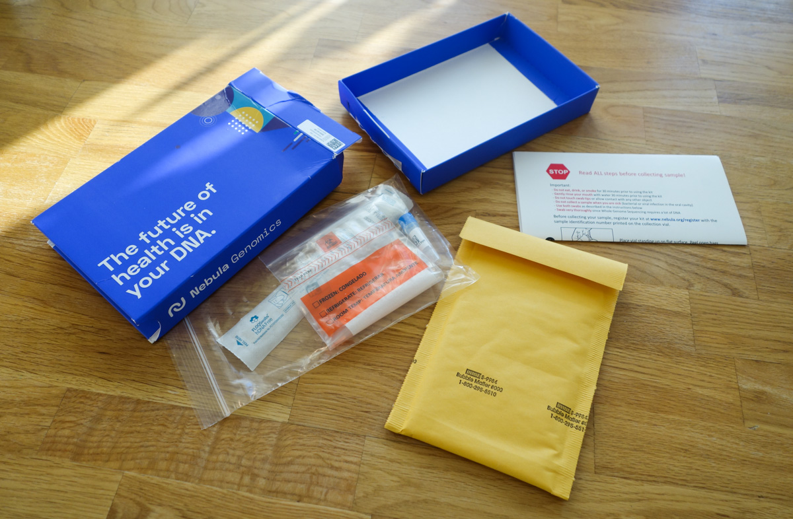
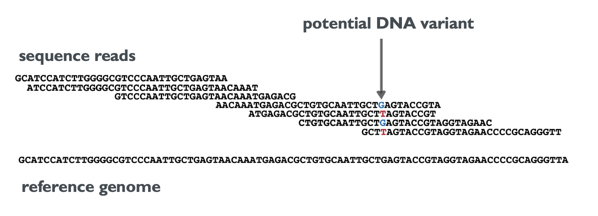
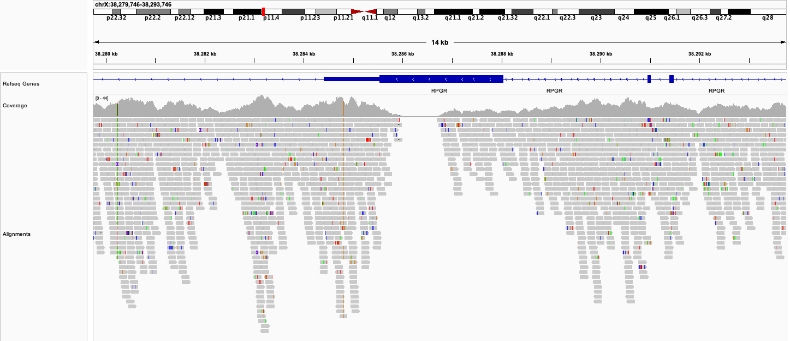

In the course of my job, I am deeply involved in the analysis of DNA sequencing data. I oversee the
development of software for the analysis and interpretation of such data for medical
laboratories. Recently, I became aware of a new wave of direct-to-consumer&nbsp;(DTC) genetic
testing companies that provide their customers with results much more comprehensive than those of
the previous wave since they are, in fact, offering Whole-Genome Sequencing (WGS). 

The previous wave, which includes companies such as 23andMe, AncestryDNA, and others, relies mainly
on Microarray technology to capture a limited set of about 700,000 genetic markers. The new wave,
including companies such as Nebula Genomics, Dante Labs, and ySeq, aims to capture the complete
human genome, which is approximately 3 billion bases long. In terms of cost, the previous wave
offers entry-level tests at around $80, while the WGS tests start at about $250. To me, this sounded
like an intriguing offer, which I had to explore out of curiosity. Therefore, I present here my
personal assessment of the results from Nebula Genomics’ “Deep Whole Genome Sequencing” product.

## Expectations, costs and privacy

Perhaps I should explain why this sounds like an interesting offer to me. At a local laboratory providing DNA sequencing services, one could expect a comparable WGS service to cost between $1000-$1800. These laboratories provide their customers with important guarantees and conveniences such as sample pick-up, one-week result delivery time, quality control check-points, and more. Additionally, they adhere to numerous local regulations regarding data security, privacy and (if needed) medical certifications. All these provisions carry a cost.

So how is it possible to get to a price below $300? Put simply, you have to optimize for low cost at every possible level. Economies of scale permit massive laboratories to operate highly automated facilities that maintain sequencing machines running at consistently high levels using bulk-purchased chemicals. Recent [announcements](https://en.mgi-tech.com/news/387/) indicate that with a certain setup and throughput a price of $150 per sample is already possible. To my knowledge, only the largest sequencing vendors from China are able to offer these prices. 

Indeed, Nebula Genomics is collaborating with BGI to sequence the samples, and there have been some [privacy concerns](https://en.wikipedia.org/wiki/Nebula_Genomics#Privacy_concerns) associated with this practice. Genetic data privacy is important, and Nebula Genomics rightly acknowledges this - their slogan is “Privacy First DNA Testing”. How does this reconcile with outsourcing of sequencing? Well, I believe there is not much choice when the price needs to be maintained at this level. As much as I’d prefer the sample not to be sent to global laboratories, this is a common practice. I personally believe that high-throughput facilities don’t have much incentive to keep samples or data (given storage costs!), and my privacy concerns would rather be related to security practices and future management changes at Nebula Genomics.

In summary, DTC genetic testing companies are expected to make certain compromises to achieve a price range acceptable to consumers. This includes sending your sample to global high-throughput labs and allowing for extended delivery times due to bulk sequencing. I recommend considering higher-priced WGS offerings, potentially from local labs, if you are uncomfortable with these compromises. In my case, I was too intrigued by the data and the reports I would obtain. Also, creating all these reports on genetic traits, ancestry, etc., is expected to be quite costly as well!

## The process

I chose Nebula Genomics primarily because I assume it is one of the largest companies among the new wave of DTC genetic testing companies. It offers a wide and diverse range of reports, as well as the ability to download the full data set. Upon ordering, you receive a package containing instructions and utilities for collecting the oral sample using a cheek swab.

The instructions are straightforward and include a kindly reminder to only provide a sample when you are fully healthy. This advice is crucial, as I've observed in other projects how an infection can result in more than 20% of the sequencing data being from virus DNA rather than the desired human DNA. In fact, I had an infection when I received the kit and, therefore, postponed the sample collection. Excluding this delay on my part, the timeline was as follows:


| Week | Status                                   |
|-----:|------------------------------------------|
|    0 | Package ordered and shipped              |
|    2 | Package received and sent back (via DHL) |
|   10 | Sample arrived for DNA extraction        |
|   20 | Sample QC and sequencing started         |
|   24 | Report is ready                          |


The total time from sending the mouth swab to receiving the results was over five months. It took eight weeks alone to ship the package from Europe to the US using DHL's standard shipping service. I presume the subsequent 10 weeks were primarily spent on logistics and collecting sufficient samples so they could be sent to the sequencing lab in bulk. Four more weeks passed before the sequencing and analysis were completed. I won't complain, as the lengthy delivery time was expected.

We can now finally delve into the wealth of data and reports that Nebula Genomics provided. Indeed, they offer a range of attractive reports about your genetic traits (both simple and complex), oral microbiome, and genetic variation. For the ancestry analysis, anticipate an extra five days to allow the relevant data to be transferred to and analyzed by their partner, Yfull. I will save a more detailed discussion of these reports for later. For now, I will concentrate solely on the downloadable data which underpins all downstream analysis. While we wait for the two days required to retrieve this data from long-term storage, let's review the type of data we anticipate…

## A brief primer on NGS technology

The new WGS tests rely on technology, commonly referred to as Next-Generation Sequencing (NGS), to generate the required DNA sequence data. In short, NGS massively parallelizes the readout of the bases (A, C, G, T) that comprise DNA sequences. Today, a single machine can generate 21 terabases per day - that's 21,000,000,000,000 instances of the letters A, C, T, or G! Occasionally, you may also see the letter N, which indicates that the base could not be determined due to technical difficulties. However, there is a significant drawback to this technology: a single readout (_sequence read_) is less than 300 bases long. This is incredibly short considering, for instance, that chromosome 1 of the human genome already is a continuous sequence of 248,956,422 bases.

Remember, our goal in WGS is to resolve all of the 3 billion bases of an individual genome. However, since the majority of bases are shared across humans, it's neither efficient nor practical to work with the full sequences of ACTGs. Instead, we utilize a "reference genome" to which we compare our own genome. From this point, we only record the differences relative to the reference. This not only saves significant storage space, but also provides a common notation for changes, allowing us to say, "Your genome differs from the reference hg38 at position 13,126 of chromosome 1, replacing an A with a C". It is important to note that different versions of the human reference genome exist, so specifying the version we are referring to is crucial.

Now, the main task for WGS can be defined as follows: Use the short DNA sequences from NGS to identify all changes in an individual's genome relative to a reference genome. We call these changes _DNA variants_. In the simplest terms, this process involves a) finding the best-matching position in the reference genome for each short sequence (_Alignment_), followed by b) detecting potential DNA variants by gathering the bases that overlap with each position in the reference genome (as shown in the image).

The number of sequences that overlap with each position is called coverage. In the provided example, the coverage at the marked position is 4. An average coverage can be computed by averaging this number over all positions in the reference genome. Because sequence reads contain errors, and because each cell of the body contains two copies of each chromosome, it is not sufficient to have each position covered once to detect DNA variants. The higher the coverage, the more reliable are the resulting DNA variants. Hence, Nebula Genomics offers WGS with an average coverage of 30x, as well as an "Ultra-deep package" with 100x coverage.

## What data is available for download?

Now that all files have been restored and are available in the Download section, I was pleasantly surprised by the specific files offered for download. The FAQ stated that I would be able to download all data in the "BAM format" and "VCF format", which are important for describing sequence alignment characteristics and genetic variant information, respectively. However, since BAM files contain alignments to the human reference genome, it wasn't explicitly stated in the FAQ whether the full dataset – including sequences not aligning to the reference – would be provided.

I discovered that the following files were available for download: 

- two FASTQ files, containing the all NGS sequence reads
- a CRAM file, containing the alignments to the reference genome in a highly compressed file format 
- a VCF file, containing the detected DNA variants
- Corresponding index files for the CRAM and VCF files which are helpful to increase the performance when working with alignments and variants, respectively

This indicates that we receive the complete data in standardized file formats - excellent! However, it's important to note that Nebula Genomics does not provide any QC reports alongside this data. In order to assess the provided data, we must analyze it ourselves. As a result, the following visualizations were created using open-source software and the Seamless NGS software. 

## Quantity and quality of raw sequencing data

I first looked at the sequencing data contained in the provided FASTQ files:

- File sizes: 2x 52 GiB (fastq.qz)
- Sequences : 2x 382,683,421
- Sequence length: 150 

Wow, that's quite a lot of data! I observed that all the sequences in the FASTQ file have a length of 150 bases, suggesting that no processing has been done on these sequences and they come directly from the sequencing machine. For technical reasons, sequence reads  usually come in pairs, which is why we have two FASTQ files with the same number of sequences.

We can use this information to calculate a theoretical coverage. We multiply the number of sequences (2x 382,683,421) by their length. This gives us the total number of bases sequenced, namely 2x 57.4 Gb (Gb denotes Gigabases, or 10^9 letters of A, C, G, T). To calculate the theoretical coverage, we divide this number by the length of the human genome (3,105,715,063 letters). This results in: 2 \* 382,683,421 \* 150 / 3,105,715,063 = 36.96x. Excellent! In theory, the coverage is quite a bit above the promised 30x.

However, various issues can arise between this theoretical number and the practical coverage available for variant calling. We might need to remove bases due to low quality. Sequences might not be human, but contaminated (perhaps from that apple you ate before taking the mouth swab, or from an infection you had). Sequences might also be artificially inflated during the sample preparation.

**With the goal to find out if the data is good for reliably detecting DNA variants, we should examine the quality of NGS sequence reads, alignments, and duplication levels. We can then calculate the actual coverage and find out what fraction of the DNA we can decode.**

Let’s begin with evaluating the quality of the bases from the sequence reads. Each sequenced base is assigned a [Phred-scale quality score](https://www.ecseq.com/support/ngs/how-are-base-qualities-calculated-and-stored) assigned by the sequencing machine.  A higher score indicates higher quality. The distribution of base qualities is often one of the most crucial quality metrics to consider:

We can observe that the median base quality for all positions in the read sequence averages to a Phred score of 36. When we average the quality for all bases in the read, we find that most sequences have a mean quality score of 37, with some even reaching up to 39. By today's standards, this is very good quality. According to their FAQ, Nebula Genomics uses the MGI DNBSEQ-T7 sequencing machine. So, are we looking at the most accurate sequences on the market? Probably not. Are we looking at the longest possible sequence reads on the market? Definitely not. However, from these QC plots (and others not shown here), we can conclude that there were no issues during sequencing. And the quality of the sequence reads represents the state-of-the-art of what you can get at this price.

## Alignments: Matching sequences to the reference genome

Nebula Genomics provides a CRAM file containing the sequences aligned to a reference genome. The CRAM is a highly efficient file format that stores the matching position and differences compared to the reference genome for each sequence. To extract its full information, you need to have access to the exact reference genome that was used for analysis. The CRAM file contains names, lengths, and checksums of the chromosomes. By reverse engineering this information, I deduced that Nebula Genomics uses a modified version of the Genome Reference Consortium Human Build 38 (GRCh38), employing UCSC nomenclature. All evidence points to the fact that they used Verily's GRCh38 genome, but when comparing it to the downloadable version ([here](https://cloud.google.com/life-sciences/docs/resources/public-datasets/reference-genomes)) I find that there are some mismatches in sequence checksums. I reached out to Nebula Genomics to obtain the precise reference genome. Regrettably, despite my repeated inquiries, they did not provide a reasonable response.

Let’s take a brief look at the alignment statistics:


|                                     |             |
| ---------------------------------- | ----------: |
| Mapped Reads (Including both pairs) | 760,446,771 |
| Unmapped Reads                      |   4,920,071 |


Most of the reads - 99,4 % to be precise -  could be aligned successfully to the human reference genome. This is a very good number, and it means that there was no major contamination of the sample which can happen, for example if you have a viral infection while taking the mouth swabs. The amount of DNA collected on the swab can also be a bottleneck for sequencing and it's good to see that this wasn't an issue here.

### Where are the bacterial reads?

One of the reports provided relates to the oral microbiome, so it reveals the types and abundances of bacteria present in your mouth at the time of testing. But how can this be determined when the sequences are aligned only to the human genome? Indeed, it is not possible to estimate this from the alignments that you get. But if you look again at the mapping statistics above, you see that 0.6% of the reads do not align with the human genome. Considering the sheer volume of data we're dealing with, these 0.6% translate to almost 5 million sequences that can be used for further analysis. Fortunately, Nebula Genomics opted to include the unmapped reads in the CRAM file, which makes it easy to extract them and conduct further microbial analysis of your own! Using the well-known taxonomic classification tool Kraken2 we indeed obtain results very similar to their oral microbiome report ([click here](./krona.html) to view my oral microbiota at that time, in case you’re interested).  

## Coverage statistics

Using the aligned sequences, we can compute the average coverage once again. Nebula Genomics promised a coverage of 30x. Let us verify if they fulfilled this promise::

The average coverage for the complete genome is 36.1, exceeding the expected value by about 20%. Very nice! We also see that there is some variation between the chromosomes. The most significant outliers are chrX and chrY, which is expected, given that I'm male and have only one of each compared to two of the others. It is somewhat unfortunate that the chrY coverage is only 11.9, as this information is valuable for ancestry analysis. I excluded the mitochondrial genome (chrM) because its coverage of 9,620 makes it a massive outlier! This is as expected since each cell contains hundreds to thousands of copies of mtDNA.

Note that the numbers above represent averages over all possible positions in the genome. In practice, the coverage is not uniform but rather looks like this:

We see that there are coverage hills and valleys, and sometimes the coverage plunges to 0. The reason is that certain regions of the genome differ in their amenability for sequencing according to their specific sequence content. Unfortunately there is no real way to mitigate this issue, other than by increasing the global level of sequencing depth (and length) to ensure that most regions still reach a minimum level of coverage. Ideally, we would aim for a coverage of 20x or more at all positions because this allows us to confidently detect the DNA variants at those positions. We can also detect DNA variants at lower coverages, but with reduced confidence. It's likely for this reason that Nebula Genomics offers a global coverage of 30x as a compromise.

Here is another way to look at the coverage:

In the protein-coding regions of the genome 88% of positions have a coverage above 20x. Unfortunately, about 1 megabase (2.7% of those positions) have such low coverage that detecting variants at all was not possible. I find it somewhat bemusing that Nebula Genomics' marketing copy describes this product with "Decodes 100% of your DNA with high accuracy," which is only theoretically true. Nonetheless, the results are still very good, as 100% coverage cannot be achieved with NGS sequencing (even at 100x).

## DNA variants and duplication levels

Duplication refers to the presence of the exact same sequence multiple times. Despite the vast amount of short-read data we sequence, the likelihood of such duplicates occurring naturally is actually very low. Thus, high levels of duplication often suggest issues during sample preparation. Due to biases introduced by duplicates, high duplication levels can lead to reduced accuracy in DNA variant detection. Consequently, these duplicates are typically excluded from variant detection. I independently assessed the duplication levels, and discovered that there were 24 million (3.2%) duplicate sequences in the data. This aligns with expectations based on other samples of good quality.

The last file that we are offered to download contains the detected DNA variants in VCF format. For our sample, the total number was a sweeping 4.84 million variants. Depending on the ancestry and the methods used, between 4 and 5 million variants can be expected in a WGS. Finally, let's consider the coverage for all detected variants. The average coverage is now 35.32x, and the distribution looks as follows:

## Summary

This concludes our analysis of the WGS data from the direct-to-consumer genetic testing company
Nebula Genomics Inc. The sequencing data comes in sufficient quantities and also in very good
quality. Together with the read length of 150 bp, which is good by current short-read sequencing
standards, this means that most sequences can be aligned to the human genome, enabling the detection
of a high number of DNA variants. The coverage remains over 30x even after the alignment and DNA variant
detection steps, indicating good preparation and processing of my sample (N=1!). Furthermore, Nebula
Genomics deserves kudos for not only making available the most relevant files (including the
complete raw sequences) but also for using standard tools (and consequently known standard contents)
to generate these files. 

In summary, I am pleasantly surprised by the great data one can receive today at such a small cost. I believe that your genome, along with other layers such as the epigenome and your microbiomes, may provide valuable insights into your health, behavior, and other traits in the future. As of today, much of this is still awaiting discovery. However, for the fearless and curious-minded, correlating your DNA variants with current knowledge can be a fun endeavor. The WGS data from Nebula Genomics can provide the foundation for this. In a future post, I will delve into the reports that Nebula already has to offer.

