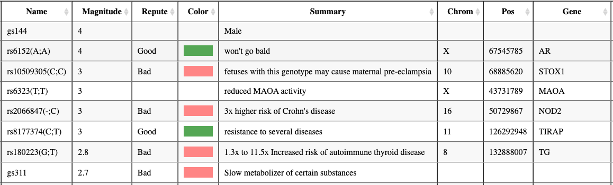
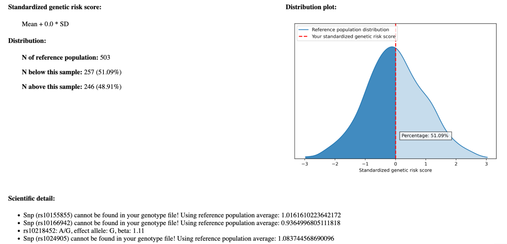
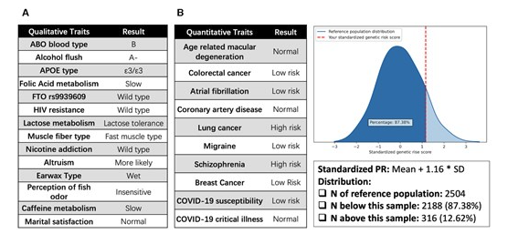

In a [previous article](https://mfasold.net/blog/understanding-nebula-genomics-health-reports/), I evaluated the health reports provided by Nebula Genomics' consumer whole-genome sequencing (WGS). There were certain aspects of those reports that concerned me. The big question implicitly raised was: can we find alternative methods for calculating polygenic scores, which serve as the scientific foundation for these reports, using the same data provided by Nebula Genomics or other WGS offerings?

Readers of this blog were kind enough to suggest several alternative solutions for analyzing genomic data. I would like to draw an important distinction between the various types of analysis. There are multiple lenses through which WGS data can be analyzed, more than you might think. The most important - and most actionable - lens is looking at the effects of individual (short) DNA variants. In the realm of non-professional genetics enthusiasts, this is what tools like Promethase and Genetic Genie are used for. The DNA variants from your WGS are matched against databases of relevant SNPs, and the consequences of your genotype are displayed. If you viewed the results of those tools in the form of a big table, the typical descriptor for each row is a dbSNP identifier like [rs1067](https://www.ncbi.nlm.nih.gov/snp/rs1067), and the main result would often be qualitative like “Caffeine metabolism = slow” (see example Promethase output below). This type of result shall **not be** the focus of this article.





Instead, I want to focus on how to compute polygenic (risk) scores (PGS or PRS). Contrary to looking at individual DNA variants, PGS is a combined calculation based on a potentially large number of DNA variants, sometimes up to thousands. If you view the result of a PGS in the form of a table, each row could refer to a trait like "Coronary artery disease" or "Schizophrenia," and the main result would be a quantitative measure like "a score of +0.75, which is higher than 95% of the population." 

Before we go on, please be aware that PGS is a controversial topic. Many good reasons are covered in [this critical article](https://undark.org/2023/10/27/consumer-genetic-testing-science/) that appeared in the Undark magazine in 2023. If you are new to this area, I strongly recommend reading the article and considering the points before over-interpreting the PGS results.

## The known unknowns of our input data {#the-known-unknowns-of-our-input-data}

We would prefer to calculate the PGS directly from the files that are made available by our consumer WGS provider. The appropriate input file would be the DNA variants that have been computed for us, which we can download in the form of a VCF file. This file contains a very long list of locations describing where and how my genome differs from a common reference genome. In my case, the reference genome used by Nebula Genomics is a variant of [hg38/GRCh38](https://www.ncbi.nlm.nih.gov/datasets/genome/GCF_000001405.40/). 

Does this VCF file give us the complete information needed to compute the PGS? In my [earlier article](https://mfasold.net/blog/assessing-nebula-genomics-dtc-wgs/), I found that limitations in the used DNA sequencing technology made it impossible to detect DNA variants for about 2.7% of possible positions in the 3.1 GB human reference genome. Let us name these *no-call* positions. If the PGS calculation includes a variant on a no-call position, we have no choice but to consider the DNA variant as unknown in the calculation. Since this is a common technological limitation, most PGS calculation tools will allow incomplete input files.

The next question is if the VCF file contains information about the remaining 97.3% of the reference genome. My VCF file contained 4.84 million variants, which - as a back-of-the-envelope-calculation - amounts to only 0.16% of all possible genome positions. What about the large remaining fraction? Well, our VCF only contains the changes with respect to the reference genome. There is the implicit assumption that there is most likely no change in the remaining positions. Let us therefore name those *reference call* positions.

<div id="no-call-vs-refcall" style="height: 360px"></div>

There are two significant implications of this. Firstly, we do not actually know which of the 99.84% positions not contained in the VCF are the no-calls and which are the reference calls. There is, in fact, no way to find this out from the given VCF file. This issue is addressed by using a so-called gVCF file format that contains information about where reference calls are (and is thus much bigger). However, consumer WGS services do not provide this file format, nor is it accepted by PGS calculation tools.

Secondly, how will PGS calculation tools deal with this relatively large gap in the input data? Given that most of the remaining positions are reference calls, it would be convenient to have an option to treat the gap positions as reference. We would then be required to accept potential calculation errors on the no-call positions[^1]. Another way is to make an educated guess based on the DNA variants that other people with a similar genetic profile have - this is possible and called [imputation](https://en.wikipedia.org/wiki/Imputation_(genetics)). 


## Impute.me - the first mover {#impute-me-the-first-mover}

If you read the Undark article, you already know some of the controversies surrounding the impute.me service. For a period, impute.me was the number 1 tool for hobbyists wanting to compute PGS. As the name implies, it used imputation to fill the gaps in uploaded data. I would have loved to try it, but the site has been taken offline in 2022 and now redirects to the Nucleus commercial service, where the lead developer of Impute.me has joined. Nucleus started its services during the writing of this article in 2024. It offers its own consumer WGS, but does not allow the upload of competing WGS data.

Are there ways to run the original impute.me service? The original GitHub repository has been replaced with a link to the new commercial service ([explanatory tweet](https://twitter.com/lassefolkersen/status/1547637066384560137)). Several people have forked the project on GitHub before its removal. Browsing the code a little bit, it is largely programmed in R and the repository seems to contain the required data in the form of RData objects. I don’t think it's worth trying to get it running.

As an entertaining twist, the original title of the 2020 paper was “Impute.me: An Open-Source, Non-profit Tool for Using Data From Direct-to-Consumer Genetic Testing to Calculate and Interpret Polygenic Risk Scores”. Two years later, the tool is not only unavailable, but also closed-source and for-profit.


## PAGEANT - ideas for a potential successor {#pageant-ideas-for-a-potential-successor}

I was happy to find a [publication](https://www.ncbi.nlm.nih.gov/pmc/articles/PMC9023285/) from 2022 describing a tool called PAGEANT, which positions itself as an alternative to Impute.me: “PAGEANT is an open-source, customizable platform with a version suitable for non-technical users.” It is a standalone software that can be run locally without the danger of being shut down. 

So I headed to the [GitHub page](https://github.com/jielab/pageant), finding that the standalone could be downloaded for Windows, Mac OS and Linux. It’s quite uncommon (in the bioinformatics community) to get non-Linux options, so I had to try it. Starting with Mac OS, the standalone would start on my M1 MacBook, but then would just load eternally. Okay, let's try the Windows version - oh no, the download has been removed from Google Drive. The Linux version, then. Luckily, it starts up.

The usage is straightforward: in the GUI, select your DNA variant file (in VCF format) and click “Analyze” to start the computation. Some minutes later, you can already inspect a report that comes as a static HTML file. This report contains several modules, of which I will focus on the module “quantitative assessment of health risk susceptibility based on polygenic risk scores and population reference”. Here is a screenshot of the result of the “Migraine” trait:



This report looks quite good initially. There is a textual description of the trait, a statistical analysis including the distribution of the scores, and a reference to the publication. In the “Scientific detail” section, we see which DNA variants have been used for the PGS calculation. I notice that many of the variants could not be found in the input file I provided. In fact, for this example, more than 50% of the 73 DNA variants could not be matched. PAGEANT will use a population average score for those variants (“mean impute”), which essentially pretends that I have an average genetic profile based on an integrated reference population of 1000 genetic profiles.

While this approach has the benefit of providing PGS results for all traits, they are far from personal. There unfortunately is no way to treat these unavailable DNA variants as reference-calls, and there is no support for gVCF files. The only way to get more personal results is to provide a more complete VCF file that contains all variants used in all covered PGS traits. I would need a list of all variant positions potentially used in the tool, as well as a newly computed DNA variant list for a more complete result. Computing this is possible (possibly also integrating genetic imputation services like [TOPMed](https://imputation.biodatacatalyst.nhlbi.nih.gov/) or [Michigan](https://imputationserver.sph.umich.edu/#!)), but definitely a technically advanced task.

The second thing that I notice is that there are only 8 PGS traits shown. The figure from the publication (image below) shows all the traits that are available in the report. After reading the publication more thoroughly, I find that this is not a tool meant to be used by, well, actual users, but is a “proof of concept and demonstration of technological feasibility” of how one could implement a user-friendly DTC genetic testing analysis tool.



My impression of the PAGEANT tool is that it combines several ideas that can make it attractive for non-technical individuals. It is a standalone package that contains all the necessary data and executables, making it ready-to-run. Additionally, it has a GUI that simplifies configuration and running, as well as an HTML report that summarizes all the information. However, these advantages do not come into play in practice for our WGS data. This is because we cannot simply use the original VCF file. Instead, we need to create a modified VCF that includes the reference calls for all relevant positions. This is precisely the technical challenge that users will not appreciate.

The software comes with 8 PGS traits out-of-the-box, and users can add additional traits. I believe that the users who are capable of compiling the necessary files for extra traits will likely not be the non-technical users that the tool is targeting. Overall, PAGEANT presents an interesting concept that unfortunately will not be practically useful to DTC-WGS customers until it is developed into an actual end-user software.

To summarize the benefits and drawbacks of PAGEANT for WGS:

* \+ In theory, easy to run as it comes as a single ZIP file that includes an executable and annotations
* \+ Compatible with Mac, Windows, and Linux
* \+ Provides a GUI for easy parameter selection 
* \- Proof-of-concept only: contains 8 exemplary traits for PGS computation
* \- Not directly applicable to WGS results (VCF files)


## The PRSKB CLI tool {#prskb-cli-tool}

Another option for calculating PGS scores is a command line tool developed by the team behind the [PRS Knowledge Base](https://prs.byu.edu/about.html). I came across this tool in a [tutorial by Joe McGirr](https://joemcgirr.github.io/files/code_tutorials/my_genome/gwascat.html#content), who also used it to assess his WGS data in a DIY manner. The tool and its corresponding publication are from 2022, which suggests that the data is reasonably up-to-date and the tools are still functional. It also appears that the tool is relatively easy to use.

Indeed, it turns out that the setup and usage of the tool are relatively straightforward. You need to [download](https://prs.byu.edu/cli_download.html) and extract a ZIP file that contains a shell script and some Python scripts. The required data files will be automatically downloaded during the process. However, the documentation is missing some instructions for the setup, and I encountered a problem with an outdated dependency. Nevertheless, with the following commands, I was able to set everything up:


```bash
pip install "setuptools<58.0"
pip install filelock requests pyvcf myvariant Bio
```


Furthermore, the application checks for an active internet connection, and it seems that this check isn’t working as intended. So I had to comment out [this line](https://github.com/kauwelab/PolyRiskScore/blob/b41e3538ab3886f0ad173ee9ad8141241560c46a/static/downloadables/connect_to_server.py#L897) in one of the Python scripts to make it work. Afterwards, the calculation can be started with a simple command. Assuming that the VCF file obtained from Nebula Genomics is called “my_wgs.vcf.gz”, that command is:


```bash
bash runPrsCLI.sh -f my_wgs.vcf.gz -o PRSKB.tsv -r hg38 -p EUR -c 0.05 -v
```


I here provide the information that hg38 is the employed reference genome, that EUR is my preferred super population and that I want a p-value cutoff of 5% for the SNPs. Furthermore, the “-v” parameter is required as the percentiles are not reported in the normal output when the input file format is VCF. The analysis is quite fast and generates an output text file in TSV format. Each line represents a polygenic score based on a certain trait-study combination, similar to Nebula Genomics library. The available table columns are described [here](https://github.com/kauwelab/PolyRiskScore?tab=readme-ov-file#output-results).

Based on the previous experience, I would first like to check the fraction of SNPs that have actually been used from our VCF file, and what has been done with the others. The [about page](https://prs.byu.edu/about.html) says, “[We] impute SNPs not found in the user's files. Instead of imputing the reference allele for the population we impute the alleles as unknown.“ This means that for variants that are not contained in the VCF (the no-call and reference-call variants), it is assumed that they are not known (no call) and their contribution to the score is computed like in PAGEANT using the average allele frequency from the selected reference population.

The PGSKB CLI tool has an option (Imputation Threshold, -h) that defines an upper limit for how many SNPs are allowed to be imputed: “We divide the number of imputed SNPs by the total number of SNPs in the calculation and if that number exceeds the threshold we do not report that study.” So by playing around with this parameter, I am able to check if enough of my DNA variants have been used instead of being imputed. The default threshold is 50%. With the default setting I obtain 11,309 entries, and with a threshold of 10% only 5,990. The maximum number is 20,798. Clearly, many variants are imputed. Again, important information that is known via our WGS data - the reference-calls - has not been used.


## Leaving the happy path {#leaving-the-happy-path}

At this point we reached a crossroad: it is not possible to continue the analysis with basic technical knowledge and standard computing resources. We can either give up or try to continue by manually creating the input files required for computing more meaningful PGS scores. Obviously, the results so far are very unsatisfactory. Therefore, I would like to continue to the best of my knowledge. This will require Linux command line scripting, bioinformatics knowledge, rewriting file formats (including cutting some corners to keep efforts reasonable), and some computing resources (16 GB RAM will not be sufficient). I will refrain from providing detailed commands here and instead, I have collected my code and resources in [this GitHub repository](https://github.com/mfasold/prs-calculation-from-wgs).

The required input for the PGSKB tool is a list of DNA variants relevant for PGS computation, including reference-calls with appropriate alternative alleles, derived from my actual WGS data. Let us call this set of DNA variants that we need to cover for the calculation *PGS variants*. The most promising option is to re-run the detection of DNA variant data in a way that ensures all PGS variants are included. In other words, we plan to reanalyze the variant calling step from the sequencing data. Nebula Genomics provided us with the alignment files, which allows us to save some early analysis steps. In practical terms, this means starting the analysis with a 55 GB alignment file (CRAM format) instead of the 200&nbsp;MB VCF file.

First, we need to obtain the list of PGS variants used by PRSKB. The PRSKB CLI tool downloads several files during its run. I have inspected those files and found that I can turn them into a variant list using a combination of awk and jq scripting. Unfortunately, we need to incorporate information from a downloaded list of all dbSNP variants and the reference genome from Nebula Genomics to create a suitable variant file in VCF format. In case you would like to do this analysis yourself, you can save time by using file PRSKB_all_variants.dbsnp.vcf.gz from the repository.

We can now use the "GATK4 Haplotype Caller" tool to call my DNA variants that match the PRS variants[^2]. This process takes about 1 hour for all the ~125,000 PGS variants. We now have suitable input data to run the PRSKB CLI tool again. When allowing 10% of the variants to be unknown via the Imputation Threshold parameter, we will now retrieve 97% of all entries. Finally, we have a list with over 20,000 PGS scores that we can work with!

The results are in the form of a big text file. Each line represents a study-trait combination (a study can comprise multiple traits, and a trait can also be analyzed in multiple studies). Depending on the study, the obtained scores for one trait can vary significantly. Here is a table with selected examples of one trait:


<table class="table fs-6">
  <tr>
   <td><strong>Reported Trait</strong>
   </td>
   <td><strong>Citation</strong>
   </td>
   <td><strong>Included SNPs</strong>
   </td>
   <td><strong>Percentile</strong>
   </td>
  </tr>
  <tr>
   <td>Prostate Cancer
   </td>
   <td>Conti et al. 2021
   </td>
   <td>256
   </td>
   <td>98
   </td>
  </tr>
  <tr>
   <td>Prostate Cancer
   </td>
   <td>Eeles et al. 2008
   </td>
   <td>11
   </td>
   <td>97
   </td>
  </tr>
  <tr>
   <td>Prostate Cancer
   </td>
   <td>Eeles et al. 2013
   </td>
   <td>22
   </td>
   <td>52
   </td>
  </tr>
  <tr>
   <td>Prostate Cancer
   </td>
   <td>Emami et al. 2020
   </td>
   <td>47
   </td>
   <td>93
   </td>
  </tr>
  <tr>
   <td>Prostate Cancer
   </td>
   <td>Hoffmann et al. 2015
   </td>
   <td>27
   </td>
   <td>93
   </td>
  </tr>
  <tr>
   <td>Prostate Cancer
   </td>
   <td>Sakaue et al. 2021
   </td>
   <td>55
   </td>
   <td>100
   </td>
  </tr>
  <tr>
   <td>Prostate Cancer
   </td>
   <td>Schumacher et al. 2018
   </td>
   <td>132
   </td>
   <td>99
   </td>
  </tr>
  <tr>
   <td>Prostate Cancer
   </td>
   <td>Takata et al. 2019
   </td>
   <td>36
   </td>
   <td>92
   </td>
  </tr>
</table>


Except for one outlier, the results are (unfortunately for me) remarkably consistent across studies.

All in all, the PRSKB CLI is a nice tool that, unfortunately, cannot be used for WGS data out-of-the-box. Probably only some minor changes would be needed to make the software work more easily. But sadly, the project seems to be in low maintenance mode, and no one responds on GitHub.

Let’s conclude the PRSKB CLI tool with the following points:


* \+ Easy to get started, as it only consists of scripts
* \+ Supports VCF and a table format
* \+ Extensive scores from more than 10k studies
* \- No gVCF support - not easy to apply to WGS
* \- No database updates since publication in 2022
* \- Probably inactive - no response to questions / issues
* \- Some small issues, and manual code editing is required
* \- Occasional download / HTTP connection errors.


## pgsc_calc {#pgsc_calc}

Another potential tool I found is [pgsc_calc](https://pgsc-calc.readthedocs.io/en/latest/), a companion tool developed in the scope of the [PGS Catalog ](https://www.pgscatalog.org/)project. The catalog is an open database of polygenic scores with accompanying metadata from the studies. The appealing factor here is that the database is constantly updated with data from new studies, and since it is maintained by a group at the EBI, better project maintenance can be hoped for. The `pgsc_calc` tool allows users to access and work with the scores from the database.

Unlike the other tools, `pgsc_calc` follows current best practices in the bioinformatics community for developing a complex workflow. Instead of a collection of scripts and vague dependencies, `pgsc_calc` is implemented using the Nextflow workflow language and sources upstream dependencies using Docker. This also means a further step up in the required technical abilities.

Running `pgsc_calc` involves the following steps.

1. Setting up Nextflow and Docker
2. Creating a sample sheet describing our WGS sample
3. Downloading a reference database required for computing percentiles
4. Creating an input VCF file suitable for `pgsc_calc`
5. Running the workflow on selected PGS scores

As it turns out, WGS data is not yet supported as an input data type. Creating a suitable input file for it requires significant effort, even more so than for PGSKG. One of the reasons is that PGS variants cannot be easily extracted from a single file; instead, we must collect score files for all relevant studies and combine them. Additionally, the matching of PGS variants to our input file works differently, and we must ensure that all variant locations and alleles match the PGS variants.

`pgsc_calc` is very strict and meticulous with its input file, and it is primarily designed for input data from arrays, the technology behind traditional DNA tests from 23&me, Ancestry etc. To be honest, attempting to make it work with WGS input is a big pain in the neck. During my attempts, I had to lower my expectations and only computed the scores I wanted to compare. For those, I was able to achieve 90-100% matching of PRS variants to my DNA variants. I tried to find a way to simplify these steps for future users, but with no success. Please feel free to take a look at [my GitHub repository](https://github.com/mfasold/prs-calculation-from-wgs), which contains the required steps.

The output of `pgsc_calc` is quite detailed and provides a lot of technical information about the analysis. It also features an HTML report with extensive information. However, it does not provide the visualizations or numbers that someone like me, who lacks statistical genetics expertise, would be looking for - not even the final percentiles. The aggregated result can be found in the file `score/[sample name]_pgs.txt.gz`, which looks like this:

```
sampleset IID     PGS        SUM     Z_MostSimilarPop Z_norm1 Z_norm2 percentile_MostSimilarPop
my-wgs    NG1E111 PGS000043  22.8074 -1.237           -1.742  -1.264  9.745
reference HG00096 PGS000043  25.3169 0.641            0.856   0.632   74.362
```

As you can see, the identifier is the only information we receive, and we need to gather the traits, citations, and other details from other sources. Although all this metadata can be downloaded, we have to perform joins over multiple tables to consolidate the information into a single table.

All things considered, I would advise any PGS enthusiast against using `pgsc_calc` on WGS data at this time. It is the most promising, thoughtful, and well-supported tool I have come across. I received prompt and excellent responses to the numerous issues I encountered. However, it is also the most stringent tool, designed for different types of input data and highly technical users. The developers informed me that support for gVCF input is part of their long-term plans, which in the future will greatly simplify the analysis of WGS data.

In summary, `pgsc_calc` comes with the following benefits and drawbacks for our use case:

* \+ Extensive and constantly updated database of 4000+ scores
* \+ Best practice bioinformatics workflows
* \+ Active development and support
* \+ Will probably be supported for longer than 2 years
* \- As of today very difficult to apply to WGS (no gVCF support, no ref calls, no multi-allelic VCFs)
* \- Requires extensive technical skills at many steps


## Comparison of obtained scores {#comparison-of-obtained-scores}

Finally, we were able to calculate PGS using two alternative tools. I am, of course, interested in how the results compare to those I received from Nebula Genomics. For example, it would be nice if I could get alternative scores for Nebula Genomics' reports from the previous article. Unfortunately, it turns out that those two are not contained in the other two databases. Nebula Genomics seems to have its own team that extracts the data from new studies.

So I have to look for overlaps in the studies available in Nebula Genomics, PGSKB, and `pgsc_calc`. It turns out that the overlap between the three is surprisingly small. Out of hundreds of potential studies, only a dozen overlap. Here is a comparison of the percentiles for six selected trait-study combinations:

<table class="table fs-6">
  <thead>
  <tr>
   <th scope="col">Trait </th>
   <th scope="col">Study </th>
   <th scope="col">Nebula Genomics </th>
   <th scope="col">PRSKB</th>
   <th scope="col">pgsc_calc</th>
  </tr>
  </thead>
  <tbody>
  
  <tr>
   <td>Prostate Cancer
   </td>
   <td>Conti, 2021
   </td>
   <td>99
<p>
n=269
   </td>
   <td>98
<p>
n=256
   </td>
   <td>93
<p>
n=269
   </td>
  </tr>
  <tr>
   <td>Low-density lipoprotein<br/> cholesterol level
   </td>
   <td>Kathiresan, 2008
   </td>
   <td>97
<p>
n=7
   </td>
   <td>96
<p>
n=7
   </td>
   <td>93
<p>
n=9
   </td>
  </tr>
  <tr>
   <td>Venous thromboembolism
   </td>
   <td>Klarin, 2019
   </td>
   <td>38
<p>
n=33
   </td>
   <td>17
<p>
n=15
   </td>
   <td>10
<p>
n=292
   </td>
  </tr>
  <tr>
   <td>Lung function <br/>
FEV1/FVC ratio
   </td>
   <td>Shrine, 2019
   </td>
   <td>36 
<p>
n=155
   </td>
   <td>25
<p>
n=161
   </td>
   <td>60
<p>
n=279
   </td>
  </tr>
  <tr>
   <td>25-hydroxyvitamin D level
   </td>
   <td>Revez, 2020
   </td>
   <td>57
<p>
n=143
   </td>
   <td>27
<p>
n=109
   </td>
   <td>66
<p>
n=1,094,650
   </td>
  </tr>
  <tr>
   <td>PR interval 
   </td>
   <td>Ntalla, 2020
   </td>
   <td>57
<p>
n=260
   </td>
   <td>35
<p>
n=197
   </td>
   <td>0 <br/>
n=582
   </td>
  </tr>
  </tbody>
</table>


For two of the six PGSs, the results are quite comparable between the tools. For the four remaining scores, there is a significant change in at least one of the three calculation tools[^3]. Below the percentiles, I wrote the number of variants used for the calculation. (I think that Nebula Genomics and PRSKB only included the variants for the European Ancestry population, whereas PGSC lists all.) Not surprisingly, the differences in the percentiles are particularly high when the number of variants also differs.

Let us look at one specific trait, Venous thromboembolism. The selected study (described in [this publication](https://www.nature.com/articles/s41588-019-0519-3)) lists 33 associated DNA variants. Nebula Genomics adds up individual effect sizes of 31 of these DNA variants and arrives at a sum of 2.52, corresponding to the 38th percentile. PRSKB refers to the entry [GCST009097](https://www.ebi.ac.uk/gwas/studies/GCST009097) in the GWAS catalog, which lists 18 variant associations, corresponding to a p-value threshold of p&lt;1e-5. The calculation of PRSKB includes 15 of those DNA variants, arriving at a score of 1.04 using an Odds-Ration weight type, or 17th percentile. Finally, `pgsc_calc` refers to the entry [PGS000043](https://www.pgscatalog.org/score/PGS000043/) in the PGS catalog, which lists 297 DNA variants. `pgsc_calc` could match 290 of those variants to my WGS data, arriving at a sum of effect sizes of 22.80. Based on my genetic profile, it assigned me to the European Ancestry superpopulation and placed my score in the 10th percentile in this population.

To better understand these differences, I selected the three variants with the highest effect size from the original publication. Then, I looked up their effect sizes in each of the tools. 


<table class="table fs-6">
  <tr>
   <th>DNA variant </td>
   <th>Original publication <br/>
EUR OR
   </th><th>PRSKB<br/>
OR
   </th>
   <th>pgsc_calc
<br/>
beta
   </th>
   <th>Nebula Genomics
<br/>
beta
   </th>
  </tr>
  <tr>
   <td>rs6025
   </td>
   <td>3.04
   </td>
   <td>2.52
   </td>
   <td>-
   </td>
   <td>0.93
   </td>
  </tr>
  <tr>
   <td>rs1799963
   </td>
   <td>2.37
   </td>
   <td>1.88
   </td>
   <td>-
   </td>
   <td>0.63
   </td>
  </tr>
  <tr>
   <td>rs9411377
   </td>
   <td>1.42
   </td>
   <td>1.35
   </td>
   <td>0.30
   </td>
   <td>0.30
   </td>
  </tr>
</table>


The original publication and PRSKB provide their associations as Odds Ratios (*OR*), whereas `pgsc_calc` and Nebula Genomics present these as *beta coefficients*. Using the formula beta = ln(OR), we find that the effect sizes of Nebula Genomics and PRSKB are the same. `pgsc_calc` also computes the same effect size for the DNA variant rs9411377. Surprisingly, the first two variants are not included in the score calculation of `pgsc_calc`. Instead, there are two other variants with large effect sizes: rs78516619 with 0.68 and rs185120584 with 0.5696. Both variants are located close to rs6025, with the latter showing a high correlation of R² = 0.8 (verified with[ LDmatrix](https://ldlink.nih.gov/?tab=ldmatrix)).

My interpretation is as follows: All three PRS calculation methods apply a statistical correction (“shrinkage”) to the effect size reported in the paper. Nebula Genomics uses a straightforward PRS calculation, including all variants reported in the original publication except those with an effect allele frequency below 5% (arguing that they cannot compute percentiles in this case). The PRSKB calculation is based on independent (“clumped”) variants with a p-value threshold of p&lt;1e-5, which corresponds to the classic PRS calculation method. All the three variants with high effect size were included in the computation. Lastly, the approach of `pgsc_calc` also includes this p-value pruning and clumping, but with a number of changes and additional corrections (P &lt; 1×10^−5; R² >0.2). I admit I do not yet understand why the two variants with the highest effect sizes are missing in `pgsc_calc`, while many additional variant associations are included[^4].

The results are intriguing in that they demonstrate some traits yield stable scores across studies and PRS calculation tools. It is also remarkable that we see significant differences in calculated scores for the very same trait-study combinations. I would like to understand in more detail what explains the differences across calculation methods, but unfortunately, my knowledge does not extend sufficiently into statistical genetics to comment.


## Summary {#summary}

The biggest surprise of my dive into calculating polygenic scores from WGS data is just how difficult it still is. Today, there doesn't seem to exist any tool that makes this task reasonably straightforward, even for technical folks with bioinformatics experience. This is remarkable because it *could* be simple if the provided and accepted file formats would just match up.

It was also very surprising to find such a flux in the space of PGS tools. Tools are published, and if they are at all available 2–3 years after publication, they are in low maintenance mode and no updates or support are provided. In this regard, I would like to express my gratitude for the people involved in building and maintaining long-lasting bioinformatics tools like the `pgsc_calc` software - it requires another level of foresight, experience, and effort to keep software and infrastructure running, engage with the community, etc.

If you would like to perform this type of analysis yourself, I would recommend using the PGSKB CLI tool. With the PGS variants file that I have prepared, this task becomes straightforward. A promising alternative in the future could be `pgsc_calc` if it supported gVCF input. However, this tool is clearly geared towards experts and requires technical proficiency and a significant amount of time for the application to WGS data.

It has been interesting to see the mixed results, with both consistencies across studies, traits, and tools, but also remarkable differences in PRS calculation methods. Maybe someone more qualified can pick up here and unravel those differences and judge if the calculated PRS are sound. I think that this finding adds another layer to the open challenges regarding PRS interpretation, which you should keep in mind when reading your WGS analysis results.


##### Footnotes

_I would like to thank Holger Kirsten for his valuable feedback on this article._

[^1]:
     When assuming all remaining genome positions (that are not in the VCF file) as reference-calls, the expected errors would probably be small. Variants in regions with many no-call positions are likely underrepresented in GWAS studies as well. However, none of the tools in this article allows us to cut this corner.

[^2]:
     The same input file as Nebula Genomics was used for variant calling with GATK4. As we are forcing GATK4 to call variants at the specified locations, I expect that filtering settings do not play a major role on the results.

[^3]:
     PR interval is a bit of an outlier, as there were multiple entries for this study-trait combination in PGCKB with a big difference in their scores: GCST010320 and GCST010321 with percentiles of 90 and 35, respectively. Also, I obtained more than usual unmatched variants in `pgsc_calc`. 

[^4]:
     I thank Sam Lambert from the PGS catalog for answering my questions regarding this and other topics. Quoting his explanation for the differences: "There are different ways of developing PGS that often differ from selecting the top/lead loci of a GWAS (what is presented in the GWAS Catalog). In the example of PGS000043 they lower the p-value threshold from GWAS-significant (5e-8) to 1e-5. There are many methods to develop PGS, see [here](https://www.nature.com/articles/s41596-020-0353-1) or [here](https://genomemedicine.biomedcentral.com/articles/10.1186/s13073-024-01304-9) for some pointers to the most common."


<script src="https://code.highcharts.com/highcharts.js"></script>
<script src="https://code.highcharts.com/highcharts-more.js"></script>

<script>

Highcharts.chart('no-call-vs-refcall', {
    chart: {
        type: 'pie',
        backgroundColor: '#fcfcfc',
    },
    title: {
        text: 'DNA Variant Call Distribution'
    },
    colors: ['#268BD2', '#2AA198', '#859900'], // Solarized color scheme
    series: [{
        name: 'Fraction',
        data: [
            { name: 'DNA variant in VCF', y: 0.16 },
            { name: 'No Call', y: 2.7 },
            { name: 'Reference Call', y: 97.1 }
        ]
    }],
    tooltip: {
        pointFormat: '<b>{point.name}: {point.y}%</b>'
    }
});
</script>
