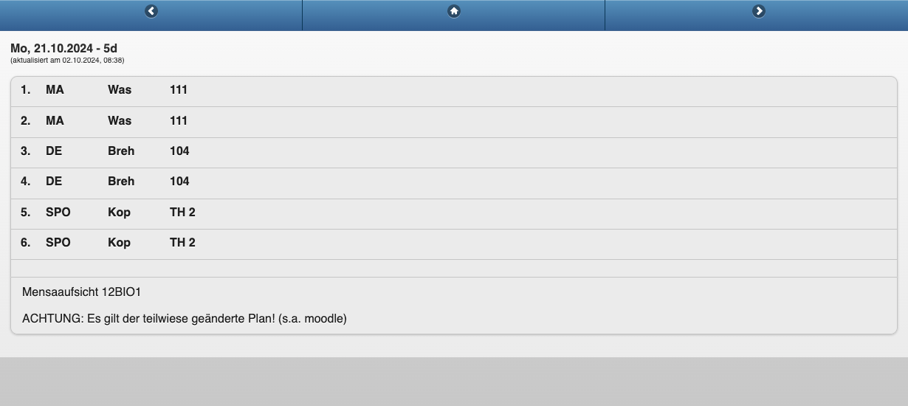

Recently, I've been looking for a quality-of-life improvement for our family's morning routine: the daily check of the timetable and substitution plan for the kids' school. The updated timetable can be accessed either on the school's website or through a mobile app called "VPmobil". The problem is that my son's mobile phone is governed by strict parental controls, making this daily lookup an unpopular chore on my side. Time to do something about this!
  
Essentially, I envision upgrading the classic school timetable on the fridge. I would like to replace the paper note with an e-ink screen that automatically fetches and displays an up-to-date timetable, including daily changes. The display should operate without a direct power connection, and the battery should last for many weeks without a recharge. Critically, this display should show the information without the ~~distraction by~~ interaction with digital devices on either my side or the kid's side.

Unfortunately, the timetable is not conveniently accessible for computer programs, as there is no public API. Our second-best option is the website, which, unfortunately, is behind a login wall and requires several clicks to reach the desired information. Therefore, *web scraping* is needed to extract the information.
  
This post describes the design decisions and implementation of my low-power e-paper display for showing the school's timetable. However, the ideas presented are sufficiently generic that they should work to display the contents of any website.

## Selection of suitable hardware

Let me be upfront: I want this to be a low-effort project. I don't want to spend a lot of time soldering hardware components, doing low-level programming, or studying rough documentation. I want a smooth DIY experience, and it would be acceptable to spend a little bit more on the hardware in exchange.
  
To this end, I was recommended the products from [Soldered](https://soldered.com/). In particular, I found the e-paper display line called Inkscape particularly appealing. They contain an ESP32 microcontroller that is particularly suitable with a sleep mode and extremely low power consumption. It has on-board Wi-Fi to fetch data from the internet. It has a battery charger and a Real-Time Clock to schedule display updates. Additionally, it has documentation with many examples that match the use case. In my case, I went for the [Inkplate 6COLOR](https://soldered.com/product/inkplate-6color-color-e-paper-board-copy/) featuring a 600x448 px display with 6 colors. I know the school timetable displays changes in red, so colors might be useful. I opted for the all-inclusive set, with the board, e-paper display, enclosure, and battery for a price of 169 EUR.
  
After the delivery, I played a bit with the various examples that are available in their public repositories. There are two ways to program the board: either using Arduino or MicroPython. At first glance, the examples and documentation for Arduino have more meat on the bones. However, with the hope of keeping line counts low—and without actual knowledge of the consequences and tradeoffs—I decided to give MicroPython a go. With the examples, I was quickly able to draw text and shapes on the screen, connect to the internet, show the battery status, and, importantly, display color images.

## Capturing the website contents
With the basics cleared up, it is time to think about how to extract the timetable from the website and get it onto the e-paper display. A suitable approach for coping with the login wall and navigating the website would be to use a browser automation tool such as Playwright. However, using browser automation for web scraping definitely requires more computational effort than would be sensible to perform on such a low-powered e-paper frame.  
  
Thus, the fundamental design shall include two components: a "server-side" web application that does the web scraping and an "on-device" application that fetches the information at regular intervals and shows it on the e-ink display. Since we have more freedom and power on the server side, it makes sense to do most of the work there. In fact, we can directly generate the image there and thus reduce the effort needed for arranging the information on the e-ink display with the device's libraries!  
  
Capturing the contents of a website using Playwright is pretty straightforward. Here is the code to navigate to the page with the timetable:


from playwright.sync_api import sync_playwright, Playwright
def run(p: Playwright):
    browser = p.chromium.launch()
    context = browser.new_context(
        http_credentials={"username": "$USER", "password": "$PWD"},
        viewport={ 'width': 270, 'height': 700 }
    )
    page = context.new_page()
    page.goto("$URL")
    page.get_by_role("link", name="Auswahl").click()
    page.get_by_text("5d").click()


This launches a browser (Chromium), defines the size of the viewport, opens a new page with our target URL, and clicks on a button on this page as well as on the next page. Note that in my case, I had to use the (quite unusual) Basic HTTP Authentication mechanism—on most pages, you can skip the `http_credentials=...` and instead [fill](https://playwright.dev/python/docs/api/class-locator#locator-fill) a login form with a username and password and click on the button. To get the code above, you can either inspect the website's HTML source or use Playwright's [codegen](https://playwright.dev/python/docs/codegen-intro) to record your actions on the website and spill out the code for you.

## Getting the exact contents the way we want

When I access the website of the school manually, I am looking at the following page at this point:

There are some elements of the page that I certainly do not want to show on the e-paper display, like the blue navigation bar on top or the dark grey footer. I would like to show the complete table as well as the headline above it. Also, I would like to keep the style in which this information is shown, like the table rows and columns and font sizes and styles. Important changes to the timetable are shown in red, which I also want to keep. In other words: extracting the information as text and displaying it in a similar way on the e-paper would be ... work.
  
Luckily, there is a way to save this work: instead of replicating the page format with all its styles, we could just take a screenshot. In this case, we have a different kind of problem: how can we get a screenshot of the interesting area only? How can we get an appropriate "zoom level" so that the screenshot matches the size of the e-paper display? And how to handle colors, like the light gray background of the table that we certainly cannot display on our 6-color e-ink?
  
Turns out Playwright already has solutions for us. We can take a screenshot not only of the full page but of specific elements on this page. In my case, I can locate the HTML element with the class ui-content and take a screenshot of this element only. Furthermore, we can adjust the styles of the elements in our screenshot to match how we want them later on our e-paper display. There are, in fact, several ways to do it, for example, using the [evaluate function](https://playwright.dev/python/docs/api/class-locator#locator-evaluate) for elements, using the style property of the [screenshot function](https://playwright.dev/python/docs/api/class-locator#locator-screenshot), or, as I did, using the [add_script_tag](https://playwright.dev/python/docs/api/class-page#page-add-script-tag) function of the page. In this case, I replace the gray backgrounds with white and reduce some paddings and margins. The "zoom level" can be adjusted with the viewport and deviceScaleFactor properties of the browser context, as we did earlier. The following code does all of this, completing our run function from above, including closing the browser and returning the screenshot image.


    js_scipt  = """
    document.querySelector('.ui-content').style.background="#FFF";
    document.querySelector('.ui-content').style.padding="5px";
    document.querySelector('#plan').style.margin="0.3em 0";
    document.querySelectorAll('#plan li').forEach(elem => elem.style.background="#FFF");    
    """
    page.add_script_tag(content=js_scipt)

    element = page.locator('.ui-content')
    image = element.screenshot()
    
    context.close()
    browser.close()
    return image


Playwright generates an image in PNG format, so we can take the output of this function and write it to a PNG file. It looks as follows:

## Preparing the image for the e-paper display

If the device library supports displaying colored PNG images, I could just serve the resulting screenshot image data and be done with it. In fact, the Inkplate Arduino library supports it, while the Micropython library does not (more on this later). Yet, I find it convenient to fully control the image creation on the server side, for example to rotate the image, deal with varying screenshot sizes and do color manipulation.
  
This type of image manipulation is best done using the [Pillow](https://pillow.readthedocs.io/en/stable/index.html) library. So we begin our function by getting the screenshot from Playwright and converting it to a Pillow image object:


def get_full_image():
    # Get image of website section
    with sync_playwright() as playwright:
        png_data = run(playwright)

    # Convert image data to Pillow image object
    screenshot = Image.open(io.BytesIO(png_data))


Next, we define our palette, which consists of the six displayable colors plus white. The definition of those colors was easily found in the [Inkplate documentation](https://inkplate.readthedocs.io/en/latest/arduino.html#inkplate-drawbitmap). We then create a new image with this restricted palette, corresponding to ["P" mode](https://pillow.readthedocs.io/en/stable/handbook/concepts.html) images in Pillow. The `image.quantize` function will find, for each color in the image, the closest color in our new palette. At this point, one could experiment with various dithering techniques—I didn't. The quantized image is pasted into the new image to ensure that the size is always the same. Finally, the bytes of the image are returned:


    # The 6 colors of inkplate color
    palette = [
        0, 0, 0, # black
        255, 255, 255, # white
        0, 255, 0, # green
        0, 0, 255, # blue
        255, 0, 0, # red
        255, 255, 0, # yellow
        255, 153, 0, # orange
    ]
    
    # Create image with restricted palette mode and white background
    screen_size = (600, 448)
    result_img = Image.new('P', screen_size, 1)
    result_img.putpalette(palette)

    # Quantize the screenshot to the restricted palette
    screenshot = screenshot.quantize(palette=result_img, dither=1)
    screenshot = screenshot.rotate(90, expand=True)

    # Paste the quantized screenshot into the result image
    crop_size = tuple(map(min, screenshot.size, screen_size))
    box = (0,0) + crop_size
    result_img.paste(screenshot.crop(box), box)
    
    return result_img.tobytes()


## Serving the image 
After we extracted the information from the website and generated the image, we would like to make this available as a web application on the internet. 

We use the `Werkzeug` library to create a very simple webserver:

from werkzeug.wrappers import Request, Response
from werkzeug.serving import run_simple

def application(environ, start_response):
    response = Response(get_full_image(), mimetype='application/octet-stream')   
    return response(environ, start_response)

if __name__ == '__main__':
    run_simple('0.0.0.0', 5050, application) 


Note that the `run_simple` web server is not meant for production web services. I do think it will be okay for a handful of requests per day.

There are now several options for hosting our application. Ideally, it should be easy to deploy, require minimal maintenance, and not cost too much. Maybe you already have a VPS that you can use. Otherwise, suitable hosting options would be Fly.io or Google Cloud Run. I chose the former, as I already have an account there.

In both cases, we need to create a Docker container with our application and its dependencies. So we need Python and the Python packages `pillow`, `Werkzeug`, and `playwright`. We also must install the browser using `playwright install --with-deps chromium`. Once we have all this defined in a `Dockerfile`, created an account on Fly.io, and installed its CLI tool `flyctl`, deployment might be as simple as `fly launch`. Here you directly get a URL like `my-cool-scraper.fly.dev` that allows us to request the image from the internet!
## Displaying the image on the e-ink device
I would like to fetch and display the image at four specified times a day to have the latest updates to the schedule displayed before school, as well as in the afternoon for packing the school bag for the next day. In between, the device should run in a low-power mode so that I can leave it running on battery for as long as possible. In other words, the e-ink display should wake up at four 'alarm' times, update the image, and then go to deep sleep.

I first tried to implement all this using the MicroPython integration but faced several problems. The WiFi connection could not be established reliably, the request for the image data via HTTPS using the `urequests` library would sometimes fail, and some `crontab`-mimicking alarm library didn't work out. Since I really had no mood to get to the bottom of these problems, I decided to use the Arduino library instead.

And this was a good call. Not only did all the image-fetching and WiFi work more reliably, but also the library is way more comprehensive and advanced. For example, in MicroPython, I had to use an external library to fetch the images from an HTTPS endpoint, and the images had to be in a 4-bit per pixel raw image format, as that was the only supported format for the image drawing function. The Arduino library has a function that can automatically fetch images from HTTPS endpoints, supports PNG and JPEG formats, and can even do dithering.

The very cool thing about the Arduino library is that it comes with dozens of examples for most of the board functions and several complete projects. I could find most of the code relevant to my project laid out in the [Show Pictures From Web](https://github.com/SolderedElectronics/Inkplate-Arduino-library/blob/master/examples/Inkplate6COLOR/Advanced/WEB_WiFi/Inkplate6COLOR_Show_Pictures_From_Web/Inkplate6COLOR_Show_Pictures_From_Web.ino)  and [RTC with deep sleep](https://github.com/SolderedElectronics/Inkplate-Arduino-library/blob/master/examples/Inkplate6COLOR/Advanced/DeepSleep/Inkplate6COLOR_RTC_Alarm_With_Deep_Sleep/Inkplate6COLOR_RTC_Alarm_With_Deep_Sleep.ino) examples.

The drawback is: the language is C++ and the code is therefore more verbose. Consequently, I will not paste the code here, but you can find it in the [GitHub repo](https://github.com/mfasold/epaper-display-website). 

The following steps will be performed each time the device wakes up:
1. Read out the current alarm time (=reason to wake up) and alarm index from the RTC.
2. Advance to the next alarm and set it on the RTC.
3. Connect to the WiFi network.
4. Fetch and display the image with the school schedule.
5. Display some other helpful information such as the current time.
6. Enable the sleep-wake-up from RTC signals on the ESP32 microcontroller.
7. Go to deep sleep.

Note that I make use of features supported by the specific hardware built into the device. In particular, there is a Real-Time Clock (RTC) module that can provide the current time, set an alarm to wake up the device, and even store a limited amount of variables. I use this to store the index of the current alarm. Just remember to insert the required coin battery!

The `set_alarm` function of the Inkscape Arduino library requires me to specify the day of the month and the day of the week. However, I could not find a library function to advance from the current day to the next day, and dealing with all the special cases with dates myself was clearly out of scope. There is a second set alarm function that is based on the Unix Epoch format, which would make it easy to specify time deltas, but this did not work reliably. So I ended up with a super-clever workaround, where I wake the device up at 23:59 if the alarm is on the next day, wait a minute, and then set the correct alarm on the now-current day. Hey, it's a hobby project :)

While we are at it... I found that the fetching of the image quite often fails on the first try. I suspect that this might be related to the autostop/autostart of machines hosted on fly.io based on incoming requests. So if the image fetching function reports an error on the first try, I just run it again. This brings me to 99.99% reliability—practically an SLA, if you ignore the fine print.

## Final thoughts
The e-ink display has found a place in our corridor, and my son checks it at least twice every school day. It works very reliably. Occasionally, I am positively surprised by what special cases it is able to display, such as excursions in some hours, splits of the class into separate courses, room changes, rescheduling and more. The date progresses correctly across new months and years; only the change between summer and winter time must be done manually. And the battery lasts more than 8 weeks, which is perfect, in that it only needs to be charged at the end of school holidays.

The beauty of this approach is a) that we can fetch arbitrary webpage contents—including those behind logins or interactive clicks—and b) that we can display the fetched information in a similar way as on the original page. There is no need to fiddle with display details such as font sizes, element alignment, or table borders. There is no need to replicate the handling of special cases like the display of room changes in red. Instead, just capture a screenshot of the website section and apply the necessary modifications to the CSS styles.

However, one caveat: I originally hoped to be able to finish this project in maybe 20 hours of hands-on time. In the end, I estimate that it was more like 50 hours. But at least 10 hours of this were spent trying to implement it in MicroPython. I really wish I had known earlier that the MicroPython library for Inkplate devices is not a first-class citizen. However, if you are looking into pursuing a similar project, I think you can do it in less than 20 hours using the [code on GitHub](https://github.com/mfasold/epaper-display-website).

As a final note, I am fully aware that even this time is probably more than the sum of the time spent checking on the phone each morning and afternoon for several years. But it eases me a lot that I just need to do one task less every morning—one interruption less from other activities. So I am actually happy with the end result. And if I feel like that in the future, there is potential to add other functions, like displaying a weather widget or random family pictures in the meantime.
