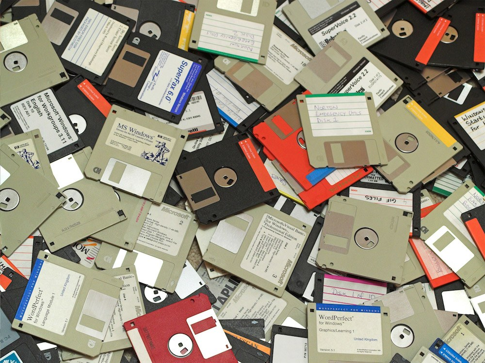

The other day, I was reading my son a book from the 90s. It contained some terms he had not heard before, so I explained the concepts of CD-ROMs and floppy disks to him.

He likes to play the game Fortnite. Occasionally, he becomes disappointed because the game needs to download a large update before he can play. The size of those updates is remarkable; I think a recent one was slightly above 61 GB. As a result, he usually cannot play Fortnite on those days.

I continued to explain that in my day, some computer games would span multiple floppy disks because the capacity of 1.44 MB was not sufficient for the game data. For example, the game The Secret of Monkey Island would span three disks, and at various points in the game, you were asked to insert a specific disk to continue. I believe the largest game I had spanned eight floppy disks; it might have been Day of the Tentacle.

We then calculated that it would take 42,361 floppy disks to accommodate the Fortnite update. Perhaps in the future, he will handle disappointment around those updates a bit better.

(Image courtesy of The Internet Archive)
