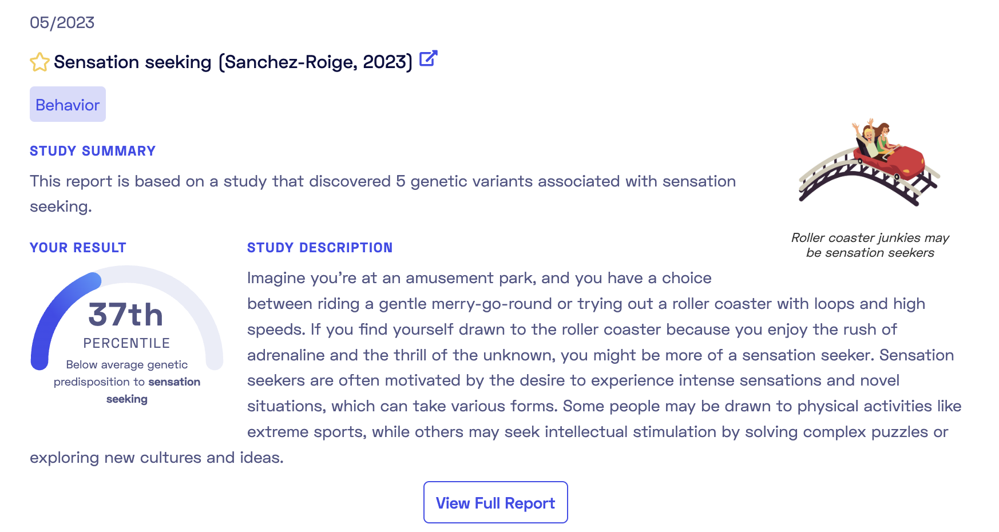
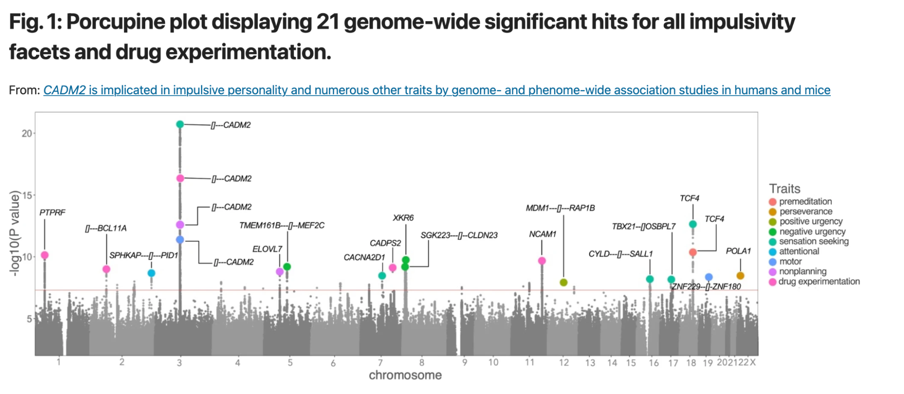
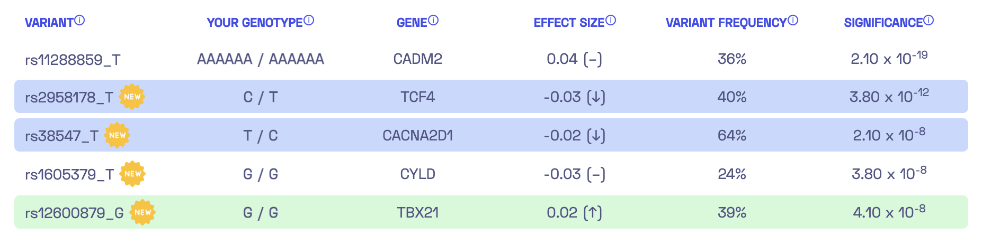
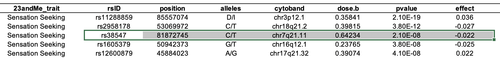
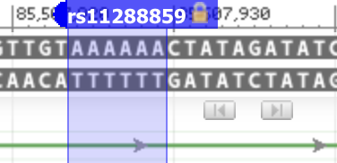
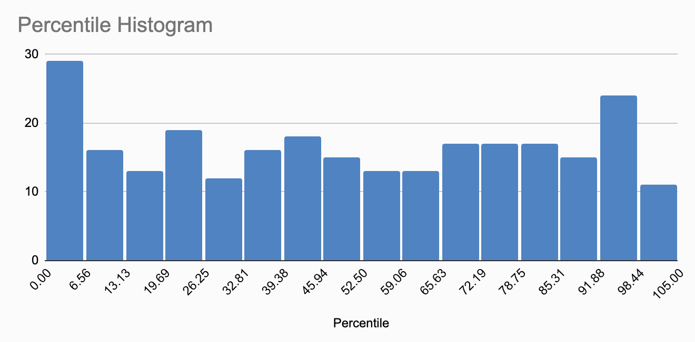
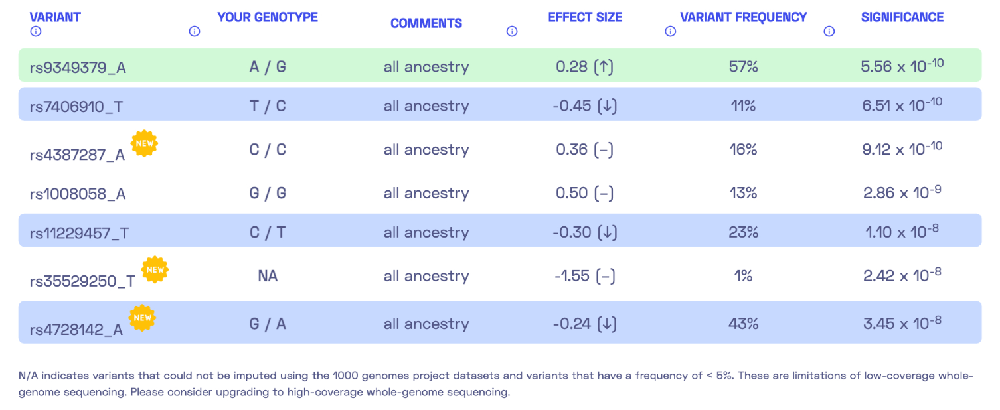
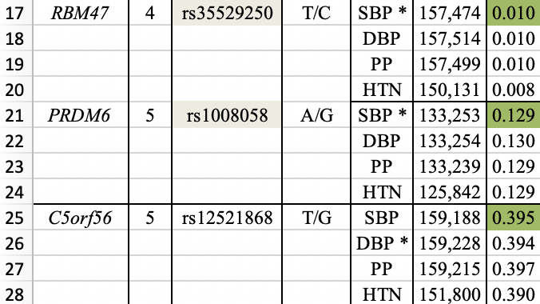
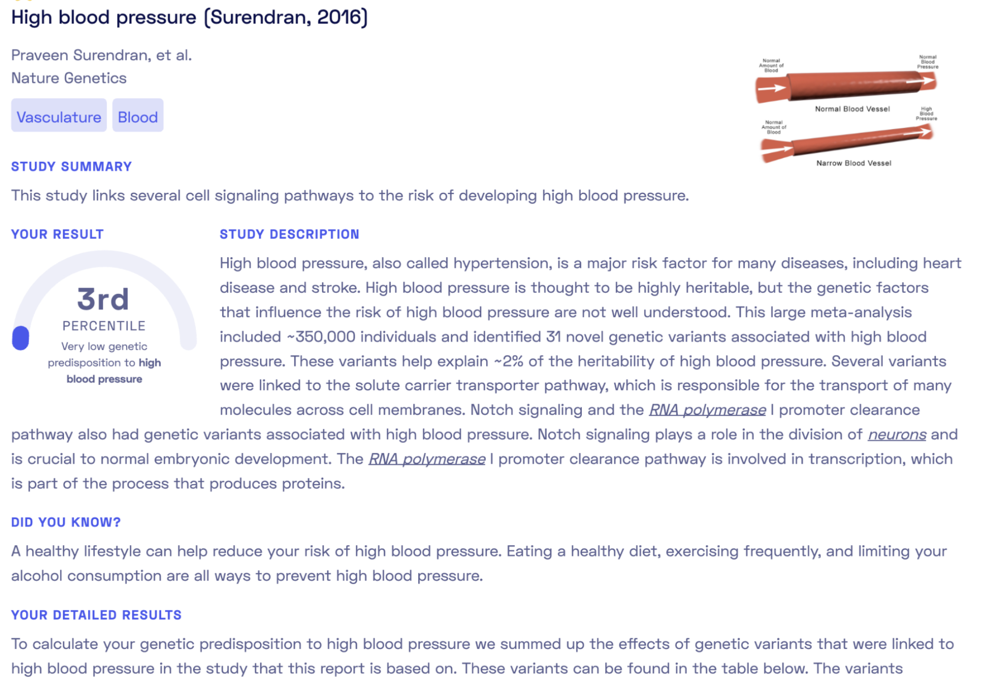
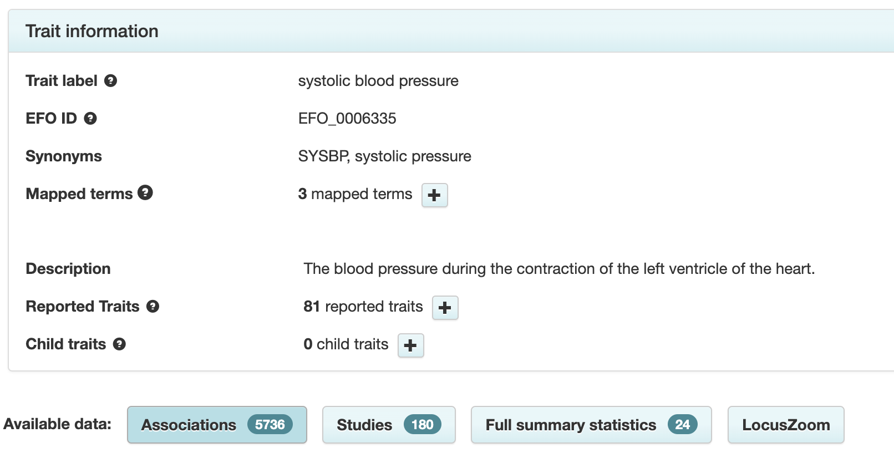

In a [previous article](https://mfasold.net/blog/assessing-nebula-genomics-dtc-wgs/), I assessed the “raw” data received from Nebula Genomics, highlighting the overall data quality and the value it offers. I however did not delve into the core aspect of their consumer genetic sequencing service, which revolves around personalized reports on genetic traits, often called _health reports_. This article aims to evaluate these reports from a computational biologist's perspective.

### Understanding the personalized reports

Nebula Genomics provides a variety of insights into whole genome sequencing results, enabling individuals to explore their ancestry, oral microbiome, genetic variation, and both simple and complex genetic traits. The Nebula Research Library, containing approximately 300 reports, forms the most comprehensive set of reports available. These reports are derived from research studying phenotype-genotype associations - relationships between traits like extraversion, blood pressure, insomnia, longevity, etc., and genetic variation. The outcome of the research is then applied to the user's personal genetic information. The idea is that users get more information about their individual genetic liability to those traits as new research emerges.

Here is an example of the overview of such a report:

As shown, the report is based on a recent [2023 publication](https://rdcu.be/deufh). Each report comes tagged with categories such as Behavior, Aging, Diet, Sleep. The report overview provides a summary and a personal genetic predisposition score (more on this later). The full report includes an in-depth study description, a detailed account of my genetic predisposition to sensation seeking, and informative add-ons like "Did-you-know" sections and links to relevant documentaries or articles. These attractively presented reports simplify complex studies into easy-to-understand terms. Browsing these reports to match studies with your genotypes can be enlightening and fun. It's likely that you will discover some traits where the genetics undeniable match with your self-perceptions. 

### The origins of genetic scores

How are these personalized scores calculated, and what is their origin? The answers lie in [Genome-wide Association Studies](https://en.wikipedia.org/wiki/Genome-wide_association_study) (GWAS). These studies screen large groups of individuals for both DNA variants (primarily SNPs) and traits to establish _associations_ between the two. For example: what DNA variants occur more often among people who are sensation seekers according to questionnaires they filled out. To grasp the results of a GWAS, refer to the Manhattan Plot from the publication on sensation seeking: 

[Source](https://www.nature.com/articles/s41398-023-02453-y/figures/1)

This plot displays numerous DNA variants (grey dots) scattered across human chromosomes (X-Axis). Each variant's correlation with a trait like sensation seeking is assessed, and the association level is plotted on the Y-Axis. Notably, five variants cross the threshold (the horizontal red line) for sensation seeking. It's crucial to understand that these studies establish associations, not causal relationships.

For each genetic variant examined, a GWAS provides two key pieces of information: an effect size and a p-value.

* Effect size: This term denotes the strength of the association between a genetic variant and a trait. If the effect size is large, that suggests that the genetic variant has a strong influence on the trait. If it's small, the variant doesn't have much of an influence.
* P-value: This is a statistical measure that tells us how likely it is that the observed data could have occurred by random chance. A smaller p-value suggests that the association between the variant and the trait is unlikely to be due to chance, whereas a larger p-value suggests that the observed association could well be a random occurrence. In GWAS studies, a p-value of less than 5 × 10−8 is often considered statistically significant (represented by the orange line in above plot)

Together, the effect size and the p-value help scientists assess the strength and significance of the association between a genetic variant and a trait. A DNA variant with a large effect size and a small p-value would be considered highly influential and unlikely to be a chance occurrence, thus potentially important on the trait in question. 

### A straightforward method for calculating the polygenic score

Now we need to convert the known associations into a personalized score that incorporates the results of whole-genome sequencing. Essentially, we want to aggregate our genotype for the five identified variants to estimate our individual genetic liability to sensation seeking. These estimates are known as polygenic scores or polygenic risk scores, and there are multiple ways to compute them. The report from Nebula Genomics’[ library](https://nebula.org/blog/nebula-library-unlocking-genetic-research/) conveniently displays the five variants:

In the left column, you can see the variants, such as rs38547\_T. This refers to a DNA variant identified as rs38547. By looking up [its entry](https://www.ncbi.nlm.nih.gov/snp/rs38547) in the dbSNP database, we can find that it is located on chromosome 7 at position 82243429 (in the reference genome version hg38) and that the reference genome has a T at this position. Furthermore, we discover that approximately 71% of the population have a T at this position, while around 29% have a C. The suffix "\_T" in rs38547\_T denotes the _effect allele_ which is the allele found in the study to have an impact on the trait. In this case, if I have a T at position 82243429 on chromosome 7, it would negatively affect my ‘sensation seeking’ by -0.02 (column 4). To ensure that the association is significant, we can check the last column, which displays a p-value of 2.10 x 10-8 for the variant.

Next, we can verify whether the [corresponding publication](https://www.nature.com/articles/s41398-023-02453-y) reports the same numbers as Nebula Genomics does in their report. In this case, the information is found in Table S8 of the Supplementary Material:

Excellent! rs38547 has an effect size of -0.022 and a p-value of 2.10 x 10-8, which matches the table above. However, we still need to determine which allele is the effect allele. After studying the publication and its supplementary materials, we find the comment "The effect allele is shown on the right" below the last table. For rs38547 this is T. Thus, we can confirm that Nebula Genomics' report contains the correct effect allele, effect sizes, and significance for rs38547.

Now, let's revisit the question of how my personal score is calculated. Nebula Genomics actually provides a description of the calculation: "By adding up the effect sizes of the highlighted variants (twice for homozygous variants), we calculated your polygenic score for sensation seeking to be -0.01." Therefore, we sum up the effect sizes, counting each occurrence of the effect allele in my DNA variants. For the variant rs38547, the second column ("Your Genotype") indicates that I have the genotype T/C, which means one of my chromosome copies has T while the other has C. Consequently, we need to add the effect size of -0.02 once for this variant. Consequently, the polygenic score for all five variants can be calculated as -0.03 - 0.02 + 2 * 0.02 = -0.01. Voilà!

It is important to note that polygenic scores are not deterministic. They do not predict with certainty whether an individual will develop a particular trait or disease, but rather provide a probabilistic estimate of their risk. Other factors, such as environmental and lifestyle factors, also play a role.

### Deletion and insertion variants

We have now successfully computed my specific polygenic score for sensation seeking. Or have we? Upon examining the first row closely, there's a pivotal point to consider. Nebula Genomics’ variant list shows "rs11288859_T", suggesting that there is an effect if I possess the T allele in the variant identified with rs11288859. Yet, when we refer to the table in the publication, we come across "D/I" instead. This might lead one to wonder: shouldn’t we only expect one of the four nucleotides – A, C, G, or T? The answer is no. Apart from the simple substitution of one base with another, there are other [types](https://varnomen.hgvs.org/recommendations/DNA/) of DNA variants. Here, "D" denotes deletion, which signifies the removal of one or more bases. On the other hand, "I" indicates insertion, representing the addition of one or more bases.

It's evident that the effect allele in the Nebula Genomics report isn't stated accurately. However, the error might merely be a mislabeling of the suffix, and the calculation itself could still be correct. To resolve this, we can refer back to the corresponding [dbSNP database record](https://www.ncbi.nlm.nih.gov/snp/rs11288859). There, we find two primary alleles: AAAAAA and AAAAA, consisting of six A's and five A's consecutively. The reference genome contains six A’s.

The five A's represent deletion, while the six A's are denoted as “I” in the publication. The notation is slightly confusing, but we can find clarity by examining population frequencies. dbSNP reports an allele frequency of AAAAAA=0.34 for the European subpopulation. The publication cites an allele frequency of 0.36 for the effect allele based on their own data for the European subpopulation (see the column labeled 'dose.b' in the table above). This aligns closely with the dbSNP frequency for AAAAAA. 

My genotype is presented as AAAAAA/AAAAAA in the “Your genotype” column of the report. Consequently, the “I” variant should be factored into my polygenic score calculation. By adding the effect size of 0.04 twice (since it appears on both chromosomes), my score would shift from -0.01 to 0.07. This is a noteworthy increase, especially considering that rs11288859 is the variant with the largest effect size. Given that there are only 5 variants used in the score calculation, it is plausible that this could alter my estimated predisposition to sensation seeking from below average (the 37th percentile) to the top 20%! What you should know about me: I've certainly been exploring all the thrilling roller coasters in the region.

### The percentile

Polygenic scores can be difficult to interpret, thus it is often more effective to present them as percentiles. To this end, Nebula Genomics calculates the Polygenic Score for 5000 of their customers and then indicates where in the resulting score distribution my personal score is located. For instance, they might say, “Your genetic predisposition for insomnia is higher than 93% of users”. Upon viewing my own results, I was taken aback by how many traits placed me in the 100th percentile (8), above the 95th percentile (26), and also in the 0th percentile (5). I began to question if my genotypes were extraordinarily unusual, or whether these results were simply due to how percentiles are computed.

After some consideration, I concluded that if I randomly sampled measures like the polygenic score from a sufficiently large population and then calculated the percentiles, the resulting percentiles should follow a uniform distribution. The same should hold true if I conducted this process for one person, but across multiple independent polygenic scores. To validate this, I extracted all the percentile numbers from all reports and plotted them in a histogram.

   
While the distribution doesn't appear perfectly uniform, I believe this is due to the limited sample size, slightly less than 300 percentiles. Personally, I do not see skewing here, and believe the minor fluctuations are simply random, within normal range. 

### Looking at another report: blood pressure

Let’s take a look at another report, this time focusing on the trait "High blood pressure." I became intrigued by this report because it indicated a very low genetic predisposition to high blood pressure, while other markers suggested a different direction. This time, the report includes seven DNA variants.

We encounter a special case where my genotype could not be determined. Please refer to my previous post where I discussed the possibility of DNA variants being undetected due to insufficient coverage. Nonetheless, we can calculate a polygenic score similar to the previous report by summing up the effect sizes of all relevant variants, resulting in 0.28 - 0.45 - 0.30 - 0.24 = -0.71. The report states, "By adding up the effect sizes of the highlighted variants, we calculated your polygenic score for high blood pressure to be -0.71. To determine whether your score is high or low, we compared it to the scores of 5,000 other Nebula Genomics users. We found that your polygenic score for high blood pressure is in the 3rd percentile." In other words, my genetic predisposition to high blood pressure is lower than that of 96% of people.

Given that this data originates from a GWAS study, it is straightforward to check the [corresponding publication](https://www.ncbi.nlm.nih.gov/pmc/articles/PMC5056636/). Interestingly, the abstract mentions, "We identified 31 novel blood pressure or hypertension-associated genetic regions in the general population...". Upon detailed examination, we find that one of these regions houses a unique gene variant containing multiple rare variant signals. This leaves us with 30 conventional DNA variants. A question then arose in my mind: Why does the report list only 7 variants when the publication references 30?

My curiosity was piqued about the missing 23 variants, so I contacted Nebula Genomics for an explanation. They responded, "We primarily exclude rare variants from our reference dataset when calculating percentiles." This rationale felt intuitive, but I felt compelled to verify it. Fortunately, the publication offers comprehensive supplementary materials. Specifically, Supplementary Table 8 contains the information about all 30 DNA variants. Here is a screenshot that shows just three of them:

The first two variants (highlighted in yellow) are featured in Nebula Genomics' report. The last column displays the frequency of the effect allele (e.g., T for the first variant) in the studied population, with the population size shown in the penultimate column. They have included a variant with a frequency as low as 0.010 (1%) - typically considered a rare variant. Conversely, the effect allele of an omitted variant has a 39% frequency, firmly categorizing it as a common variant. Consequently, the given explanation doesn't align with the observed numbers.

Naturally, I had to ask for additional information. The ensuing correspondence, however, was protracted and circuitous, with them occasionally redirecting queries back to me (like inquiring about the specific variants I was missing). After three months and 13 messages, I received the following answer: “The paper is investigating multiple different blood pressure related traits. That’s why there is a large number of variants reported. In contrast, the report is looking at systolic blood pressure (SBP) only. Hence, we include a subset of the variants.”

Acknowledging this perspective, I decided to focus on the trait systolic blood pressure. I once more consulted the supplementary table from the publication. A look at the previously mentioned table section reveals that the first two variants have indeed been validated for systolic blood pressure (indicated by an SBP*), whereas the third variant is not. Out of the 30, nine variants are associated to SBP. Naturally, my next step was to evaluate the allele frequencies of the yet-unaddressed variants, rs34591516 and rs61760904, which are 0.055 and 0.008 respectively. Given that the first variant's frequency is above 5%, I remain unconvinced by the rare variant argument.

### Going big picture: making use of personalized scores 

After delving deep into the nuances of missing variants, let's take a step back and ask: what is our actual objective with personalized scores, and is it truly beneficial to include more variants? The central promise of these reports is that they enable you to discover genetic health risks (e.g., a heightened risk for breast cancer, drug metabolism) as well as other genetic conditions and traits (e.g., lactose intolerance, vitamin D deficiency) based on your DNA sample. To achieve this, we need to find the most accurate explanations for changes in traits depending on DNA variations.

Decades of genetic research have shown that only very few traits (e.g., lactose intolerance, earwax type) rely on a limited number of DNA variants. The vast majority of traits are influenced by numerous DNA variants - often hundreds or thousands are needed to explain the trait variation. Moreover, each individual variant typically has only a small impact on the observed phenotype. As a result, GWAS is largely a numbers game: researchers require vast sample sizes to identify significant associations. A saturation point was first achieved in a [2022 study](https://www.nature.com/articles/s41586-022-05275-y) on the height trait. Using data from 5.4 million individuals, researchers identified 12,111 DNA variants that accounted for nearly all the SNP-based trait variation.

**For an accurate depiction of trait variation, the score calculation should encompass as many associated DNA variants as feasible.**

When considering the high blood pressure trait, it is logical for us to expect that all relevant DNA variants will be included in the report. However, there's a discrepancy: we were discussing 7 or 9 DNA variants earlier, but we've just learned that traits are often associated with hundreds of variants. Here is the beginning of the Nebula Genomics’ report:

While we receive a good description of the content of the study the report is based on, the bigger question arises: do the results accurately represent my personal risk for high blood pressure? Do I genuinely have a very low genetic predisposition to high blood pressure, in fact, lower than 97% of their customers? The report states, “To calculate your genetic predisposition to high blood pressure we summed up the effects of genetic variants that were linked to high blood pressure in the study that this report is based on.”

At this point, it would be beneficial to know how many variants are known to be associated with high blood pressure. Fortunately, databases like the [GWAS Catalog](https://www.ebi.ac.uk/gwas/) compile the results of GWAS. Searching this database for the [trait “systolic blood pressure](https://www.ebi.ac.uk/gwas/efotraits/EFO_0006335)” reveals that today there are 180 studies reporting 5,736 variants associated with this trait.

Some of these DNA variants refer to interactions of systolic blood pressure with other traits, but there are still several thousand known associations. Blood pressure is among the best-studied traits. I manually checked some of the variants with the most significant associations, and none of them appeared in the High Blood Pressure report. The reason is as straightforward as it is unexpected: the study the report is based on merely **expands **the set of variants associated with blood pressure by 31 **novel variants**. To reiterate, these 31 variants are added to the existing list of thousands of known associations.

Although all the information necessary to understand this is present in the report, I find it tremendously confusing and potentially misleading. What value is there in computing a nebulous score based on a handful of newly discovered variants? It's like gauging the local climate based on weather observations from the last few days. Phrases like "Very low genetic predisposition to high blood pressure" lead me to believe that this computation offers a credible measure of high blood pressure. In reality, it selects just 9 out of thousands of (mostly more relevant) indicators of high blood pressure.
 
And one more point: The study summary of the report states "These variants help explain ~2% of the heritability of high blood pressure.” In the underlying publication by Surendran et al., we find that these already small 2% actually refer to other variants discovered in an [earlier study](https://www.ncbi.nlm.nih.gov/pmc/articles/PMC4498745/) (which incidentally estimates the heritable fraction of total trait variation to be 40%). Therefore, the new variants covered in the report likely explain significantly less than 2% of the heritability. 

Interestingly, Nebula Genomics' library contains another report on the same trait ("Systolic Blood Pressure") based on a different study, which identifies an additional 32 novel variants. According to this report, my genetic predisposition to high blood pressure significantly differs (35th percentile vs. 3rd percentile)! In conclusion, I believe the method of selecting individual studies to produce reports with personalized risk scores is marginally useful for many traits.

### Summary

My original intention for this article was simply to understand the reports from Nebula Genomics and to compare them, using my knowledge of genomics, to the underlying publications. However, I was not entirely convinced by what I found, prompting me to delve deeper into the subject than I had intended. From a large collection of reports, I chose two for a more detailed examination, and both contained errors. One report had a significant miscalculation related to DNA variants that are deletions or insertions, and the other missed variants mentioned in the publication. 

What I find even more concerning is my realization that using individual studies as sources to infer personalized genetic scores for complex traits is likely to yield inaccurate results. A more effective approach would be to produce a single comprehensive report for each trait, which incorporates a broader sample of the associated variants for the score calculation. I understand that significant expertise and effort are required to convert the outcomes of multiple GWAS (or meta-studies) into a personalized score. 

On the bright side, the reports are well-written and visually appealing. However, extrapolating my findings from examining two of them, I must conclude that any insights about my genetics are, at best, vague connections at this juncture.

_I would like to thank Holger Kirsten for his valuable feedback on this article._
